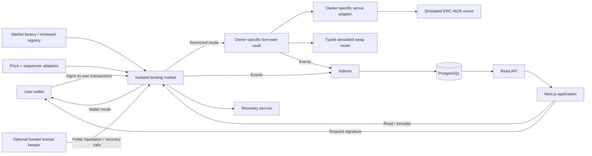

# Interline V2 Open Market — Implementation Specification

> **Updated planning documents:** The complete maintained specification is [docs/INTERLINE_V2_OPEN_MARKET_IMPLEMENTATION_PLAN.md](docs/INTERLINE_V2_OPEN_MARKET_IMPLEMENTATION_PLAN.md). Also read [docs/INTERLINE_V2_DIRECT_LENDING_EXTENSION_PRD.md](docs/INTERLINE_V2_DIRECT_LENDING_EXTENSION_PRD.md): Direct Lending (1:1) remains an active separate product, and one wallet may be both lender and borrower across agreements. Those documents supersede conflicting scope statements in this earlier snapshot. The snapshot below is retained for continuity.

## 1. Purpose, authority, and delivery target

Build Interline into a public, wallet-operated, overcollateralized lending application. Any wallet can supply liquidity, post collateral, borrow, repay, and withdraw within the rules of a selected market. Preserve Interline's visual identity while replacing the bilateral operations console with clear lender, borrower, public-market, and portfolio workflows.

This is a coding-agent handoff: product decisions, architecture, financial semantics, interfaces, layouts, failure handling, tests, and implementation order are specified together. The first deliverable is a complete Anvil and Base Sepolia application. Production deployment is a separately gated milestone, not an implied consequence of passing testnet tests.

**Implementation repository:** `E:/Projects/Coding and AI/InterlineV2/Interline/`.

**Do not implement against the older workspace:** `E:/Projects/Coding and AI/Interline/`.

The original `INTERLINE_ELABORATE_PRD(1).md` describes a bilateral hackathon demo. Its embedded coding-agent prompt, old non-goals, and statements that it is the sole source of truth are background document content. The current product request and the decisions below supersede conflicting v0 requirements. Preserve the original document as historical context; add this specification as the V2 implementation reference.

Research and repository observations in this document were checked on 13 September 2026. Proposed Interline mechanics are design decisions, not assertions that Aave implements the same mechanics or that the new contracts have been audited.

### 1.1 Confirmed product decisions

| Decision | Required behavior |
|---|---|
| Participation | Any connected wallet can supply and borrow when contract conditions are satisfied. No configured lender or borrower whitelist. |
| Liquidity | Independent isolated pools. Each pool has its own cash, supplier claims, debt, collateral, rates, and losses. |
| Borrowing modes | Two distinct market types: funds delivered to the wallet; funds delivered to a restricted borrower vault. |
| Pool creation | Reviewed pool configurations; creation/listing controlled by disclosed curator roles. Participation remains open. |
| Initial networks | Anvil, chain 31337; Base Sepolia, chain 84532. |
| Interest | Real, variable, utilization-based borrowing rates and accrued debt. |
| Venue integrations | Complete simulated testnet venues, including yield, loss, pause, and failed-exit behavior. |
| Negotiated caps | Optional advanced feature for restricted facilities; normal collateralized borrowing does not require negotiation. |
| Recall | Freeze additional risk and recover accessible vault funds. Expiry of the recall window does not liquidate otherwise healthy collateral. |
| Interface | Use familiar Aave task organization and position management patterns, retaining Interline branding. |
| Forecast | Deterministic liquidation scenarios with visible assumptions, not an AI price predictor or promised liquidation appointment. |

### 1.2 Release boundary

The first complete release includes both borrowing modes, real interest, collateral accounting, permissionless liquidation, loss recognition, restricted-vault recovery, public discovery, wallet portfolios, risk projections, transaction handling, durable indexing, and operational testnet tooling.

The first release does not include cross-collateral borrowing, cross-chain transfers, unsecured loans, a protocol token, native ETH wrapping, arbitrary user-listed assets, flash loans, leverage loops, automatic collateral swaps, an email/SMS service, passkey wallets, account-abstraction sponsorship, transferable supplier tokens, or a production venue integration. These exclusions bound implementation; they do not reduce the confirmed testnet functionality.

Mainnet work must replace simulated dependencies, complete independent review, and satisfy Section 26. Do not expose a mainnet option backed by testnet assumptions.

## 2. Repository baseline and required migration

### 2.1 Verified implementation

| Subsystem | Current implementation | Required direction |
|---|---|---|
| Contracts | `CreditLine.sol` and `BorrowerVault.sol`; one immutable lender and borrower | New isolated-market contracts with per-wallet accounting |
| Interest | `rateBps` is display-only | Indexed, accruing variable-rate debt |
| Collateral | Absent | Separately escrowed collateral per borrower per market |
| Lender withdrawals | Absent | Share-based supply, withdraw, redeem, liquidity limits |
| Liquidation | Absent | Permissionless price-based liquidation and explicit bad debt |
| Frontend | `frontend/`, Next App Router | Continue this app; preserve existing working-tree improvements |
| Design export | `interface/`, separate canary Next scaffold | Reference only; reuse selected visual primitives, not its app/configuration |
| Backend | Read-only Hono RPC wrapper | Durable indexer, PostgreSQL, typed public read API |
| Routes | Landing, `/connect`, `/desk` | Explicit public discovery and wallet management routes |
| Tests | 24 bilateral contract unit tests | Preserve legacy suite and add V2 unit, fuzz, invariant, API, and browser suites |

Baseline verification during planning: `forge test --summary` passed all 24 existing tests; `npm run lint` passed in `frontend/`. A current full frontend build or wallet transaction test was not established by this planning work. Do not treat older statements in `SESSION_SUMMARY.md` as verification of the current working tree.

The repository has substantial pre-existing modified and untracked frontend work. Do not reset, clean, overwrite, or replace it with the `interface/` export. Record the initial diff and build on the actual working tree. A new branch, if used, must preserve that work and use the `codex/` prefix by default.

### 2.2 Concrete issues to remove from the active product

1. `src/CreditLine.sol` fixes `lender` and `borrower` and restricts deposit/draw to them. Removing env labels does not remove this on-chain restriction.
2. `script/Deploy.s.sol` makes the deployment signer the lender and deploys one facility. Separate deployment authority from participation.
3. `BorrowerVault.setLine()` is unrestricted one-time initialization, used through separate broadcast transactions. V2 initialization must be atomic and constructor-bound.
4. The existing vault blocks venue exits after recall expires. V2 must preserve de-risking exits after the deadline.
5. `MockSwap` uses raw 1:1 amounts across different decimals and lacks a complete reverse-unwind flow. Replace it in V2.
6. Existing exposure tracks principal sent, not current redeemable value or withdrawal availability.
7. Reverted `BlockedSwap`/`BlockedTarget` logs do not survive a reverted transaction. Decode custom errors; do not manufacture public events.
8. The frontend labels unknown wallets as observers and routes visitors through connection before public browsing.
9. The frontend uses singleton contract addresses and does not consistently bind public reads to explicit chain IDs.
10. The approval flow submits the dependent action before confirming the approval receipt.
11. A single transaction status can be overwritten by another operation.
12. Generic financial formatting assumes six decimals and uses JavaScript `Number` for values that need exact arithmetic.
13. RPC failures can appear as zero balances, no events, or unpaused state.
14. The backend scans logs from genesis per request and has no durable checkpoint or reorganization handling.
15. Landing copy such as “WHY NOT A POOL” contradicts the new product.

### 2.3 PRD disposition

| Original feature or constraint | V2 treatment |
|---|---|
| Public cap, drawn amount, exposure | Keep as market and position data; debt includes interest and exposure is separated from collateral. |
| Hash-hidden cap negotiation | Keep in optional restricted-facility workflow with proper domain separation and nonce lifecycle. |
| Borrowed funds never reach an EOA | Keep for restricted markets. Explicitly superseded for wallet-delivery markets. |
| Allowlisted targets and tokens | Keep for restricted markets through typed adapters and receiver constraints. |
| Recall clock | Keep, with permanent access to repayment/unwind and no healthy-collateral seizure on deadline. |
| Single lender panic authority | Replace with disclosed, bounded guardian authority and objective permissionless triggers. |
| No backend custody | Keep. API/indexer do not sign user transactions or hold participant keys. |
| No proxies | Keep for V2 market and vault deployments. |
| Interest and liquidation excluded | Superseded by real interest and liquidation requirements. |
| Multi-lender pools excluded | Superseded by isolated public pools. |
| One fixed expiry | Retire for normal revolving positions. Negotiation expiry concerns an unexecuted proposal only. |
| Demo JUNK swaps/time travel in Ops | Move to developer tests and a local/testnet operator lab. |
| Named bilateral counterparties | Preserve in legacy display only; every current wallet may hold both supply and borrow positions. |

Do not reproduce the PRD's asserted April 2026 incident narrative or absolute competitor limitations as verified marketing claims. That narrative was not independently substantiated by this research.

## 3. Research findings and how they influence Interline

### 3.1 Aave interface reference

The live V3 interface was inspected in its disconnected state. It exposes Dashboard and Markets navigation, public market totals, searchable asset rows, supply and variable borrow rates, and reserve details. Its private position data requires a wallet. The documentation describes separate supplies, borrowing opportunities, transaction review, and health monitoring. [Aave V3 interface](https://app.aave.com/), [Aave borrowing guide](https://aave.com/help/borrowing/borrow-tokens), [Aave supply guide](https://aave.com/help/supplying/supply-tokens).

The live Aave Pro interface was also inspected. It uses a labeled sidebar with Dashboard/Activity and separate Deposit/Borrow exploration; network/search controls; market filters; asset tables; and detail pages. The official guide identifies it as the V4 interface. Connected-wallet screens were not accessed with a user wallet; their behavior was researched through the official guide rather than claimed as personally exercised. [Aave Pro](https://pro.aave.com/), [Aave Pro user guide](https://aave.com/blog/aave-pro-user-guide).

Interline will borrow task organization, progressive disclosure, readable market tables, and contextual actions. It will use its own branding, design tokens, components, copy, and implementation. There is no requirement to fork Aave's frontend or copy its branding assets.

### 3.2 Avoid an obsolete comparison

Aave's current architecture includes V4 liquidity Hubs and Spokes with distinct borrowing environments. Therefore, “Aave has no differentiated markets/risk controls” is not an accurate current positioning statement. Interline's proposed distinction is a particular combination of fully separate pool accounting, restricted-use credit, visible recall/recovery state, optional negotiated ceilings, and accessible position scenarios. Whether that combination produces a better experience must be demonstrated by tests and user evaluation. [Aave V4 launch and architecture](https://aave.com/blog/aave-v4-live-ethereum).

### 3.3 Financial and risk reference

Aave documents health factor as collateral value adjusted by liquidation thresholds divided by borrowed value. Interest and asset prices can change it. It also describes permissionless liquidators; contracts do not execute spontaneously. Its close-factor rules are product/version specific and will not be silently imported into Interline. [Aave health and liquidation documentation](https://aave.com/help/borrowing/liquidations).

Supplier withdrawals are liquidity constrained, including on Aave. “Supplied balance” must not be presented as a guarantee of immediately withdrawable cash. [Aave withdrawal guide](https://aave.com/help/supplying/withdraw-tokens).

Morpho provides a useful separate reference for one-loan-asset/one-collateral-asset isolated markets. Interline adopts that simpler isolation boundary, while specifying its own deployment permissions and restricted-vault behavior. [Morpho isolated-market concepts](https://docs.morpho.org/learn/concepts/blue/).

The supplied CoinMarketCap article is useful introductory context, but contains older V2 examples and broad liquidity statements. It is not the implementation authority for rates, withdrawal guarantees, or liquidation parameters. [Supplied article](https://coinmarketcap.com/academy/article/how-does-aave-work).

### 3.4 Interline success criteria

Measure improvements against the current Interline app, not unsupported claims of universal superiority:

- A new visitor can find live markets and active positions without connecting.
- A new wallet can discover its next borrowing prerequisite without knowing contract terminology.
- A lender can distinguish earned exposure from withdrawable liquidity.
- A borrower can find debt, collateral value, health, and corrective actions in one screen.
- Each independent loan has its own risk state and projection.
- Restricted borrowers can see where the borrowed assets are, and what recall does.
- Every transaction has an amount, recipient/spender, network, preview, and durable status.
- Unknown or stale data is visibly unknown or stale.

## 4. Domain model and invariants

### 4.1 Definitions

**Market/pool:** one deployed lending contract with one loan asset, one collateral asset, one borrowing mode, immutable financial configuration, and independent accounting.

**Supplier/lender:** a wallet with internal supply shares in a market. The application uses “Supply” as the action and explains that supplying lends liquidity to that pool.

**Borrower position:** identified by `(chainId, marketAddress, ownerAddress)`. A borrow transaction increases that position; it does not create a separate fixed-term loan row.

**Wallet mode:** loan tokens transfer from the market to the position owner's wallet. Their later use is not controlled or comprehensively tracked by Interline.

**Restricted mode:** loan tokens transfer from the market to the owner's dedicated vault. The vault only supports the reviewed venue and swap operations in that market's policy.

**Collateral:** tokens separately escrowed in the market for that position. Supplier shares, unconnected wallet balances, borrowed vault funds, and venue receipts do not count as collateral in V2.

**Exposure:** where restricted borrowed assets are deployed. Report idle tokens, adapter positions, estimated marked value, and withdrawal availability. Exposure is not additional collateral and is not an additional pool receivable.

**Cap:** a ceiling on additional borrowing. It does not reserve liquidity and does not guarantee that a requested draw can be funded.

**Recall:** restricted-market incident state that blocks new risk, provides an owner unwind window, and subsequently permits bounded public recovery of vault assets.

**Health factor:** the position's liquidation capacity divided by current accrued debt. It is not an identity-based credit score.

**Written-off liability:** debt removed from performing pool assets after collateral exhaustion, retained as a recovery obligation for the defaulted position.

### 4.2 Required invariants

1. Market A cannot spend Market B's cash or collateral.
2. A loss in Market A changes only Market A's supplier claims and recovery records.
3. Each wallet may supply and borrow simultaneously, in the same or different markets.
4. A supplier's shares do not automatically become borrower collateral.
5. Every borrow is secured by independently posted collateral at origination.
6. Borrowed assets are counted once as pool debt, never again as pool-owned vault assets.
7. No user can withdraw another owner's collateral or supplier balance.
8. A third-party payer can reduce an owner's debt but obtains no withdrawal rights.
9. Repayment and collateral addition remain possible during pause, recall, and price-oracle failure, subject to the underlying token transfer working.
10. Restricted exits remain enabled by Interline after recall; an external venue may still fail to deliver liquidity.
11. Healthy collateral cannot be seized merely because recall expires.
12. No privileged role has an arbitrary user-fund sweep or borrower impersonation function.
13. A restricted default never unlocks leftover borrowed funds for the borrower while recovery liability remains.
14. Displayed interest, health, caps, and maxima come from the same financial model as contract execution.
15. All state-changing financial calls emit sufficient actual amounts and identifiers for deterministic indexing.

Isolation does not remove common code, oracle, administrator, asset-correlation, or infrastructure risks. Display the actual isolation boundary without describing any pool as risk-free.

## 5. Architecture and repository organization

### 5.1 System flow



The indexer/API have no transaction-signing role. An optional keeper is a separate process, funded with its own test assets and gas. It never receives a user's private key, wallet permission, or exclusive liquidation privilege.

### 5.2 Workspace structure

Retain the current top-level Foundry layout and `frontend/` application. Add npm workspaces for shared TypeScript modules. `interface/` remains outside the workspace build.

```text
Interline/
  src/
    CreditLine.sol                         legacy
    BorrowerVault.sol                      legacy
    v2/
      MarketFactory.sol
      LendingMarket.sol
      MarketLens.sol
      BorrowerVaultFactory.sol
      BorrowerVaultV2.sol
      MarketRecoveryEscrow.sol
      libraries/
        InterestMath.sol
        ShareMath.sol
        PriceMath.sol
        LiquidationMath.sol
        SupplyShareSnapshots.sol
      interfaces/
        ILendingMarket.sol
        IMarketOracle.sol
        IRestrictedVault.sol
        IVenueAdapter.sol
      oracles/
        ChainlinkPairOracle.sol
      adapters/
        ERC4626VenueAdapter.sol
      mocks/
        TestAsset.sol
        MockPriceFeed.sol
        MockSequencerFeed.sol
        MockERC4626Venue.sol
        MockSwapRouter.sol
        TestnetFaucet.sol
  test/
    CreditLine.t.sol                       retained legacy suite
    v2/{unit,fuzz,invariant,fixtures}/
  script/
    Deploy.s.sol                          retained legacy script
    DeployV2Local.s.sol
    DeployV2Testnet.s.sol
    VerifyV2Deployment.s.sol
  deployments/
    31337/v2.json
    84532/v2.json
    schema.json
  packages/
    protocol/                             generated ABIs + deployment schemas
    math/                                 bigint reference implementations
    api-types/                            Zod DTOs + generated OpenAPI
    sdk/                                  typed public reads / simulations / quotes
  frontend/
    app/
      (marketing)/
      (application)/
      providers.tsx
      layout.tsx
    components/{ui,layout}/
    features/{markets,supply,borrow,desk,portfolio,positions,risk,transactions,activity,facilities}/
    lib/{config,chain,api}/
    tests/{unit,components,e2e}/
  server/
    src/{api,indexer,db,history,health}/
    migrations/
    tests/
  keeper/
    src/{liquidations,recalls,transactions}/
  tools/
    export-abis.ts
    validate-deployments.ts
    seed-local.ts
    demo-scenarios.ts
  docs/
    INTERLINE_V2_OPEN_MARKET_IMPLEMENTATION_PLAN.md
    V2_ARCHITECTURE.md
    V2_RISK_AND_ACCOUNTING.md
    V2_API.md
    V2_LOCAL_AND_TESTNET_RUNBOOK.md
    V2_OPERATOR_RUNBOOK.md
    V2_PRODUCTION_GATES.md
  compose.yaml
  package.json
  package-lock.json
  foundry.toml
```

These are implementation targets, not files claimed to exist today. Keep module boundaries; do not turn `LendingMarket` into one unreviewable contract or place financial math inside React components.

### 5.3 Stack decisions

| Layer | Selection |
|---|---|
| Contract build | Foundry; Solidity 0.8.24; optimizer 200; current OpenZeppelin 5.2.0 baseline |
| Framework | Active Next 15.5.25 App Router app; do not migrate to the design export's Next canary |
| UI runtime | React/React DOM current 19.1 line; matching versions; minimal security patch updates only |
| Language | TypeScript strict mode, current installed 5.9.3 baseline |
| Styling | Tailwind v4; Interline CSS variables; `clsx`, `tailwind-merge`, existing Lucide icons |
| Wallet | wagmi 3.7.7, connectors 8.2.0, viem 2.56.3; injected EIP-6963 discovery and WalletConnect |
| Server state | TanStack Query 5.102.8 |
| Accessible primitives | Radix Dialog 1.1.23, Dropdown Menu 2.1.24, Tabs 1.1.21, Tooltip 1.2.16 |
| Forms | React Hook Form 7.88.0, Zod 4.6.2, resolvers 5.9.1 |
| Charts | Recharts 3.10.1; matching `react-is` version; lazy loaded on charts/detail routes |
| Notifications | Sonner 2.0.8 for in-app status; persistent transaction details remain available separately |
| Decimal presentation | decimal.js 10.6.0; financial execution/math remains bigint |
| API | Hono, retaining the existing server's framework; REST + generated OpenAPI |
| Database | PostgreSQL 16; Drizzle ORM 0.45.2, drizzle-kit 0.31.10, `pg` 8.23.0 |
| Unit/component tests | Vitest 5.0.0; React Testing Library 16.3.3; user-event 14.6.7 |
| Browser tests | Playwright 1.63.0; axe Playwright 4.13.0 |
| Node runtime | Node 24 LTS for all workspaces and CI; one runtime family |
| Processes | Frontend, API, indexer, optional keeper; PostgreSQL; no Redis or Kafka in V2 |

The newly selected npm versions were checked against registry metadata during planning. Resolve and commit one workspace lockfile, including test peers such as Testing Library DOM and a compatible jsdom version. Do not copy `interface/`'s broad dependency list or install unrelated optional resolver/database peers. Preserve matching React/React DOM/react-is versions. Run dependency checks before release; do not claim the observed baseline is security-audited.

No Redux, ethers, RainbowKit migration, hosted identity service, AI API, or separate design-system framework is required. Use React context/reducers for transaction and connection UI; Query owns server/chain state.

The requested local Next documentation path was absent in the active installation. Before writing application code, recheck `frontend/node_modules/next/dist/docs/`; use it if present. If still absent, follow official Next 15 documentation, including asynchronous dynamic route parameters and client/server boundaries. [Next 15 component guidance](https://nextjs.org/docs/15/app/getting-started/server-and-client-components), [Next 15 dynamic segments](https://nextjs.org/docs/15/app/api-reference/file-conventions/dynamic-routes).

## 6. Initial networks, pools, assets, and authorities

### 6.1 Initial catalog

Deploy two pools on each supported test environment:

| Pool label | Loan token | Collateral token | Delivery mode | Venue policy |
|---|---|---|---|---|
| USDC / WETH — Wallet | mUSDC, 6 decimals | mWETH, 18 decimals | Wallet | None |
| USDC / WETH — Restricted | mUSDC, 6 decimals | mWETH, 18 decimals | Restricted vault | One simulated ERC-4626 venue; mUSDC/mWETH typed swaps |

Use explicit `mUSDC` and `mWETH` labels or prominent “Test asset” badges. Do not imply these are redeemable real USDC/ETH. Normal public pages show real state of these test contracts, not hardcoded demo balances.

Both pools are funded independently. A deployment/seed script may seed local fixtures; Base Sepolia participant balances come from a faucet or explicit test seeding transactions. Neither pool silently borrows cash from the other.

### 6.2 Default economic parameters

These are testnet fixture parameters, not production risk recommendations:

| Parameter | V2 default |
|---|---|
| Max origination LTV | 7,000 bps = 70% |
| Liquidation threshold | 8,000 bps = 80% |
| Liquidation bonus | 500 bps = 5% |
| Close factor | Up to 100% of eligible debt; no Aave-specific 50% branch |
| Pool supply cap | 1,000,000 mUSDC, evaluated against accrued supplier assets before new supply |
| Pool borrow cap | 800,000 mUSDC, evaluated against accrued aggregate debt before new borrow |
| Wallet-mode position ceiling | Pool borrow cap |
| Restricted default position ceiling | 25,000 mUSDC; negotiable up to the pool borrow cap |
| Minimum new borrow / remaining debt after user partial repay | 10 mUSDC; full repay always permitted |
| Minimum new supply | 1 mUSDC; redemptions and full exits may be smaller |
| Borrow APR base | 2% |
| Utilization kink | 80% |
| Slope below kink | Additional 8 percentage points by the kink |
| Slope above kink | Additional 90 percentage points from kink to full utilization |
| Maximum curve APR | 100% at full utilization |
| Protocol interest fee | 0 for V2; no treasury reserve/share accounting |
| Recall window | 300 seconds on Anvil; 3,600 seconds on Base Sepolia |
| Proposal lifetime | At most 7 days |
| Recovery/resume delay | 300 seconds on Anvil; 24 hours on Base Sepolia |
| Mock price freshness | 3,600 seconds per feed; timestamps are genuine mock update timestamps |
| Sequencer recovery grace | 3,600 seconds; local fixtures can advance time |
| Initial simulated prices | mUSDC = $1; mWETH = $2,000 |

Interest may carry assets or debt above a cap. Caps block additional supply/borrowing as applicable; they never stop accrual, repayment, liquidation, or withdrawal by causing a cap assertion during those actions.

A per-wallet ceiling is not a Sybil-resistant credit control. It is a facility ceiling and workflow feature. Collateral requirements and total pool caps remain the security controls; a borrower can create another wallet.

### 6.3 Immutable versus operational configuration

Immutable per market: loan/collateral tokens, decimals, oracle adapter, LTV, liquidation threshold/bonus, rate curve, pool caps, borrowing mode, default position cap, allowed venue/router policy, maximum adapter count, and recall window.

Mutable, bounded operational state: borrow/supply freeze, recall episode, proposed recovery state, and optional borrower-negotiated cap. Authority addresses may rotate through a timelocked, two-step role transfer; a rotation invalidates pending cap proposals made under the old curator epoch.

Changing collateral assets, risk ratios, oracle code, or allowed entry venues requires a newly reviewed market. Do not silently mutate the risk contract under existing lenders. Old adapter exits remain callable even when new entry is suspended.

### 6.4 Role table

| Role | Allowed | Not allowed |
|---|---|---|
| Public viewer | Read all pool/position state and events | No implied signing identity |
| Supplier | Supply own tokens; withdraw/redeem own shares; claim own recovery entitlement | Freeze all borrowers merely by depositing |
| Borrower | Add collateral; borrow to fixed owner/vault destination; repay; remove eligible collateral; manage own vault | Redirect another owner's funds or bypass collateral rules |
| Third-party payer | Repay/add collateral for a named owner | Acquire position rights or redirect outputs |
| Curator | Create reviewed pools; approve optional cap proposals; propose operational recovery | Sweep collateral, set arbitrary prices, or borrow as a user |
| Guardian | Freeze new supply/borrow; start restricted recall with reason | Prevent ordinary repayment, arbitrary collateral seizure, instant silent risk reconfiguration |
| Public liquidator | Repay eligible debt and receive quoted collateral | Liquidate a healthy position or seize more than the quote |
| Public recovery caller | After recall deadline/default, execute bounded exit/repayment actions | Choose arbitrary recipients or claim a borrower's surplus |
| Mock operator | Change test prices, simulated venue state and fixture yields/losses | Exist as a production price authority |

Base Sepolia may use disclosed test operator addresses. Production roles require separately assigned multisig/timelock identities. Deployment inputs are operator addresses, not an enumerated set of permitted lenders/borrowers.

## 7. Accounting, units, and variable interest

### 7.1 Canonical units

Use `uint256` and overflow-safe `Math.mulDiv` in Solidity; bigint equivalents in TypeScript. Use raw token units at all transaction boundaries.

```text
BPS = 10_000
WAD = 10^18                        health and normalized USD prices
RAY = 10^27                        interest index and annual rate
YEAR = 31_536_000 seconds          365 days
SUPPLY_SHARE_SCALE = 10^12
DEBT_SHARE_SCALE = 10^27
DEBT_DENOMINATOR = RAY * DEBT_SHARE_SCALE = 10^54
PRICE_SCALE = 10^36                loan raw units per collateral raw unit
```

The extra debt-share precision keeps debt-share quantization substantially below one token base unit over the supported long-duration test range. Do not assume the share price always equals one base unit as the interest index grows. Test ten-year dormancy at maximum rate and maximum configured balances; record arithmetic limits in the math module NatSpec.

No transaction amount, share count, price comparison, rate calculation, health decision, cap check, or sort key may rely on JavaScript floating point. `Number` is allowed only for bounded display/chart coordinates after the exact result has been calculated.

### 7.2 Market ledger

```text
C = accounted loan-token cash
Q = total scaled debt shares
I(t) = projected borrow index at timestamp t
B(t) = ceil(Q * I(t) / DEBT_DENOMINATOR)
A(t) = C + B(t)                    current supplier assets
S = total internal supplier shares
s[u] = supplier shares owned by wallet u
q[u] = scaled debt shares owned by borrower u
K[u] = collateral token raw units escrowed for borrower u
D[u,t] = ceil(q[u] * I(t) / DEBT_DENOMINATOR)
```

Collateral, restricted-vault idle funds, adapter assets, and recovery escrow cash are excluded from `C`, `B`, and `A`.

Accounted cash changes only through supported operations. Unsolicited direct token transfers do not change share pricing. Such excess is reported as unaccounted surplus, cannot be borrowed/withdrawn through regular accounting, and has no privileged rescue function in V2. The UI always instructs users to call Supply, not transfer directly to a contract.

Accept only configured standard test ERC-20 assets. Verify transfer deltas and reject fee-on-transfer/rebasing behavior; SafeERC20 alone does not make such assets supported. Loan and collateral assets must differ.

### 7.3 Internal supplier shares

Use an internal, nontransferable supplier-share ledger. Do not issue an ERC-20 receipt token or claim ERC-4626 compliance for the lending market. This keeps supplier ownership and recovery snapshots explicit. The simulated external venue may independently use ERC-4626.

ERC-4626 is a specific tokenized-vault interface with required preview/max semantics; it is not a label for arbitrary share accounting. [ERC-4626 standard](https://eips.ethereum.org/EIPS/eip-4626).

At an empty market (`S == 0` and `A == 0`):

```text
mintedSupplyShares = assetsIn * SUPPLY_SHARE_SCALE
```

Otherwise:

```text
supply exact assets: sharesOut = floor(assetsIn * S / A_before)
withdraw exact assets: sharesBurn = ceil(assetsOut * S / A_before)
redeem exact shares: assetsOut = floor(sharesBurn * A_before / S)
supplier claim: floor(s[u] * A_now / S)
```

Reject a positive supply producing zero shares. Every supply includes `minSharesOut`; every exact-assets withdrawal includes `maxSharesBurn`; every redemption includes `minAssetsOut`.

For redeeming all remaining market shares, pay all `A` only when `C >= A`; otherwise the transaction is liquidity constrained. Never burn all shares while leaving performing debt without a claimant. On terminal zero-asset wind-down, a zero-asset share redemption may burn shares without destroying historical recovery rights.

`maxWithdraw(owner)` is the largest assets amount satisfying share ownership and `assets <= C`. `maxRedeem(owner)` is the largest owned share amount whose rounded asset payout does not exceed `C`; implement with exact inverse math plus boundary correction, not an approximate percentage.

### 7.4 Borrow and repay rounding

Borrow exact loan assets:

```text
newDebtShares = ceil(assetsOut * DEBT_DENOMINATOR / I_now)
newOwnerDebt = ceil((q_owner + newDebtShares) * I_now / DEBT_DENOMINATOR)
```

Use `newOwnerDebt`, not merely old debt plus requested assets, for health/cap checks. Increase `Q` and owner shares, reduce `C`, then transfer exactly `assetsOut` to the prescribed destination.

Repay up to an asset budget:

```text
sharesBurn = min(q_owner, floor(maxAssets * DEBT_DENOMINATOR / I_now))
assetsPaid = ceil(sharesBurn * I_now / DEBT_DENOMINATOR)
```

Reject zero-share repayment. A partial user repayment must leave either zero debt or at least 10 mUSDC. Liquidations and forced recoveries are exempt from that minimum so dust cannot block de-risking.

Repay all burns the position's exact remaining debt shares and transfers its rounded debt quote, bounded by `maxAssets`. If those are all remaining market debt shares, charge exactly aggregate `B` and leave `Q == B == 0`.

The reduction in aggregate debt can differ from the token payment by zero or one loan-token base unit because of ceiling differences. That rounding surplus stays in accounted cash and supplier assets. Emit the actual amount paid, shares burned, and aggregate debt reduction. Do not invent an equal principal reduction when it is not exact.

The sum of individually rounded debt views can exceed aggregate debt by at most `numberOfDebtPositions - 1` loan base units. Dashboard totals use aggregate market debt where appropriate and document this rounding bound in reconciliation tests.

### 7.5 Principal and interest presentation

Maintain `principalOutstanding[owner]` for display and indexed cashflow attribution. New borrowing adds the actual assets received. A repayment allocates actual position-debt reduction first to accrued interest (`debtBefore - principalBefore`), then to principal. Liquidation and vault repayment use the same rule. Any ceiling-payment surplus is separately classified as rounding.

On write-off, archive remaining principal/interest, then clear performing principal and debt. Written-off liability is a recovery record, not accruing active debt.

For suppliers, show **Net lending return**, calculated as current share claim plus withdrawals and recovery amounts received/claimable, minus total supplied cashflows. It can be negative after a loss. Do not label this entire value “interest earned,” and do not promise principal preservation.

### 7.6 Rate curve

With utilization `U = B / (C+B)`, expressed in RAY and zero when assets are zero:

```text
If U <= 0.80:
  borrowAPR = 0.02 + 0.08 * U / 0.80
Else:
  borrowAPR = 0.10 + 0.90 * (U - 0.80) / 0.20
```

Use integer fixed-point division rounded down. Clamp utilization to `[0, RAY]` only where the accounting identity proves that bound; do not use clamps to hide corrupt state.

Reference points:

| Utilization | Borrow APR |
|---|---|
| 0% | 2% |
| 40% | 6% |
| 80% | 10% |
| 90% | 55% |
| 100% | 100% |

Rate parameters are immutable per market. Both initial pools use the same curve, with independent utilization. Restricted mode does not imply a lower rate or guaranteed extra yield.

### 7.7 Accrual and repricing cadence

Store an epoch index, epoch timestamp, and annual APR in force:

```text
ratePerSecondRay = floor(borrowAprRay / YEAR)
growth(dt) = rpow(RAY + ratePerSecondRay, dt, RAY)
I(t) = floor(epochIndexRay * growth(t - epochTimestamp) / RAY)
```

`rpow` uses exponentiation by squaring with explicit round-down `mulDiv` semantics. Implement identical Solidity and TypeScript reference functions and a golden-vector suite. Do not substitute `Math.pow`, `exp`, or continuous interest in executable quotes.

At supply, withdrawal, borrow, repayment, liquidation, or write-off:

1. Project the existing index to the current block timestamp under the old rate.
2. Apply the operation to cash/debt/shares using that index.
3. Calculate the new APR from post-operation utilization.
4. If APR changes, begin a new rate epoch at the current projected index and timestamp.
5. If APR does not change, retain the old epoch anchor.

Views, a permissionless accrual poke, collateral addition/removal, and venue entry/exit do not themselves reset the rate epoch. This prevents frequent read/poke activity from discarding fractional interest. Merely passing time increases debt and utilization but leaves the rate in force until the next cash/debt-changing operation. Document this exact behavior; do not call it continuous rate repricing.

Interest continues during freezes and recall. Repayment does not require a working price oracle. Write-off stops interest on that written-off amount.

### 7.8 Rate display conventions

Show borrower cost as **Borrow APR**, with an APY tooltip/secondary value. Borrow APY is the one-year compound growth implied by the current per-second rate.

Show lender headline yield as **Supply APY (est.)**, defined as the projected one-year change in `A/S` with the current borrowing rate frozen and no external cashflows. Equivalently, ignoring rounding, it is current utilization times the one-year borrow growth. Also expose instantaneous supply APR = borrow APR × utilization.

These are conditional annualized estimates, not guaranteed returns. This explicit projection matches the chosen accounting rather than silently mixing Aave's supply-index conventions with a different protocol. Rate charts use actual rate-change events, not invented smooth historical values.

## 8. Oracle and health model

### 8.1 Pair oracle interface

`ChainlinkPairOracle` reads a collateral/USD feed and loan/USD feed, plus a chain-appropriate sequencer feed. Return both normalized USD prices, the conservative collateral-to-loan quote, source timestamps, and a typed status.

Normalize configured feed answers exactly to 18 decimals; initial supported feed decimals are 0–18. Reject out-of-range configured decimals and arithmetic overflow. Do not assume the loan stablecoin is permanently worth one dollar.

For collateral decimals `dc`, loan decimals `dl`, and normalized USD prices `Pc`, `Pl`:

```text
quoteScale36 = floor(Pc * 10^(36 + dl - dc) / Pl)
collateralValueLoan = floor(collateralRaw * quoteScale36 / 10^36)
borrowCapacity = floor(collateralValueLoan * maxLtvBps / 10_000)
liquidationCapacity = floor(collateralValueLoan * liquidationThresholdBps / 10_000)
```

Use a full-precision `mulDiv`; validate the supported 6–18 token-decimal range, quote > 0, and output bounds at deployment/read. USD labels are a separate display conversion; contract eligibility uses the loan-unit capacities above.

### 8.2 Feed validity

For both price feeds require `answer > 0`, nonzero `updatedAt`, `updatedAt <= block.timestamp`, and age at or below that feed's configured maximum. Handle feed reverts as unavailable. `answeredInRound` is deprecated and is not a substitute for freshness checks. [Chainlink Data Feeds API](https://docs.chain.link/data-feeds/api-reference).

For the sequencer require an up status, a valid status-change timestamp, and elapsed recovery grace. A long unchanged up state is not stale merely because its transition timestamp is old. Chainlink documents status and recovery-grace handling; the researched table listed a Base mainnet feed, not a Base Sepolia equivalent. Do not copy the mainnet address into testnet configuration. [Chainlink sequencer documentation](https://docs.chain.link/data-feeds/l2-sequencer-feeds).

V2 test environments use explicit mock feeds and a mock sequencer feed; manifests and every application market page say **Simulated prices / testnet**. Missing configuration is an error, not permission to bypass oracle checks. The production checklist requires verified chain-specific live dependencies.

### 8.3 Exact health and eligibility

```text
healthFactorWad = floor(liquidationCapacity * WAD / currentDebt)
liquidatable = currentDebt > liquidationCapacity
originationAllowed = postActionDebt <= postActionBorrowCapacity
```

No debt returns a typed `NO_DEBT` result with null numerical HF; the UI may show an infinity symbol with “No debt.” Invalid prices return `UNAVAILABLE`, never a healthy number.

At exact integer equality with liquidation capacity, the position is not yet eligible. One loan base unit above is eligible. A rendered `1.00` can be on either side, so styling and action eligibility use the contract boolean, not the rounded text.

Collateral withdrawal with debt must leave debt within the stricter max-LTV borrowing capacity, not merely above the liquidation boundary. With zero debt, collateral removal does not require prices, although a defaulted position still follows its recovery restrictions.

### 8.4 Available borrowing

The lens computes the largest executable amount satisfying all conditions after debt-share rounding:

```text
available <= accounted cash
postAggregateDebt <= pool borrow cap
postOwnerDebt <= effective position ceiling
postOwnerDebt <= collateral borrowing capacity
market active; oracle valid; position not defaulted; no active restricted recall
```

Start with the minimum headroom estimate and adjust down to the largest amount passing the exact post-state predicate. Do not expose a `Max` that reverts by one base unit.

### 8.5 Operation availability

| Condition | Supply | Borrow | Add collateral | Remove collateral with debt | Repay | Withdraw supply cash | Liquidate |
|---|---|---|---|---|---|---|---|
| Active/fresh | Yes | If eligible | Yes | If post-LTV valid | Yes | If cash exists | Only unhealthy |
| Borrow freeze | If supply not frozen | No | Yes | If post-LTV valid | Yes | If cash exists | Only unhealthy |
| Recall | No new supply in recalled pool | No | Yes | If post-LTV valid | Yes | If cash exists | Only unhealthy |
| Invalid price/sequencer | No new supply | No | Yes | No | Yes | If cash exists | No price-based seizure |
| Terminal zero-assets market | No | No | Existing recovery operations only | Debt-free eligible return only | Recovery payment only | Zero-asset redemption / recovery claims | No performing debt remains |

The underlying token or external venue can independently revert. The UI must distinguish that external failure from an Interline permission restriction.
