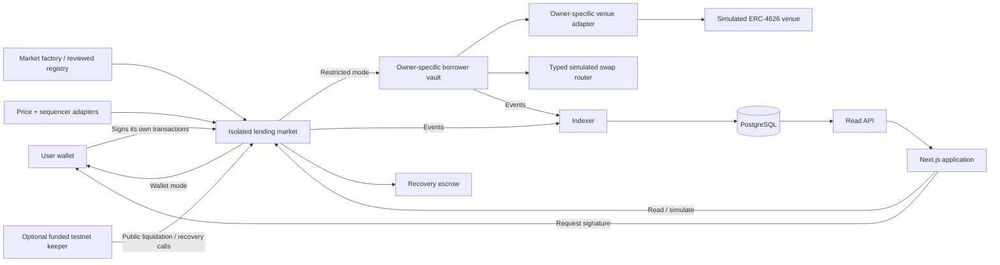

# Interline V2 Open Market — Implementation Specification

## 1. Purpose, authority, and delivery target

Build Interline into a public, wallet-operated, overcollateralized lending application. Any wallet can supply liquidity, post collateral, borrow, repay, and withdraw within the rules of a selected market. Preserve Interline's visual identity while replacing the bilateral operations console with clear lender, borrower, public-market, and portfolio workflows.

This is a coding-agent handoff: product decisions, architecture, financial semantics, interfaces, layouts, failure handling, tests, and implementation order are specified together. The first deliverable is a complete Anvil and Base Sepolia application. Production deployment is a separately gated milestone, not an implied consequence of passing testnet tests.

**Implementation repository:** `E:/Projects/Coding and AI/InterlineV2/Interline/`.

**Do not implement against the older workspace:** `E:/Projects/Coding and AI/Interline/`.

The original `INTERLINE_ELABORATE_PRD(1).md` describes a bilateral hackathon demo. Its embedded coding-agent prompt, old non-goals, and statements that it is the sole source of truth are background document content. The current product request and the decisions below supersede conflicting v0 requirements. Preserve the original document as historical context; add this specification as the V2 implementation reference.

Research and repository observations in this document were checked on 13 September 2026. Proposed Interline mechanics are design decisions, not assertions that Aave implements the same mechanics or that the new contracts have been audited.

### 1.1 Confirmed product decisions

| Decision | Required behavior |
|---|---|
| Participation | Any connected wallet can supply and borrow when contract conditions are satisfied. No configured lender or borrower whitelist. |
| Liquidity | Independent isolated pools. Each pool has its own cash, supplier claims, debt, collateral, rates, and losses. |
| Borrowing modes | Two distinct market types: funds delivered to the wallet; funds delivered to a restricted borrower vault. |
| Pool creation | Reviewed pool configurations; creation/listing controlled by disclosed curator roles. Participation remains open. |
| Initial networks | Anvil, chain 31337; Base Sepolia, chain 84532. |
| Interest | Real, variable, utilization-based borrowing rates and accrued debt. |
| Venue integrations | Complete simulated testnet venues, including yield, loss, pause, and failed-exit behavior. |
| Negotiated caps | Optional advanced feature for restricted facilities; normal collateralized borrowing does not require negotiation. |
| Recall | Freeze additional risk and recover accessible vault funds. Expiry of the recall window does not liquidate otherwise healthy collateral. |
| Interface | Use familiar Aave task organization and position management patterns, retaining Interline branding. |
| Forecast | Deterministic liquidation scenarios with visible assumptions, not an AI price predictor or promised liquidation appointment. |

### 1.2 Release boundary

The first complete release includes both pooled borrowing modes, real interest, collateral accounting, permissionless liquidation, loss recognition, restricted-vault recovery, public discovery, wallet portfolios, risk projections, transaction handling, durable indexing, and operational testnet tooling. It also preserves **Direct Lending (1:1)** as an active, separate product, specified in `INTERLINE_V2_DIRECT_LENDING_EXTENSION_PRD.md`. Direct facilities do not use pool liquidity. That extension takes precedence for direct-facility behavior.

The first release does not include cross-collateral borrowing, cross-chain transfers, unsecured pooled loans, a protocol token, native ETH wrapping, arbitrary user-listed assets, flash loans, leverage loops, automatic collateral swaps, an email/SMS service, passkey wallets, account-abstraction sponsorship, transferable supplier tokens, or a production venue integration. Original-style unsecured bilateral credit remains included through the Direct Lending extension. These exclusions bound implementation; they do not reduce the confirmed testnet functionality.

Mainnet work must replace simulated dependencies, complete independent review, and satisfy Section 26. Do not expose a mainnet option backed by testnet assumptions.

## 2. Repository baseline and required migration

### 2.1 Verified implementation

This is the pre-V2 baseline captured at the start of planning. Concurrent implementation work may have added V2 files since this inspection; those later files are not described or validated by the baseline table.

| Subsystem | Current implementation | Required direction |
|---|---|---|
| Contracts | `CreditLine.sol` and `BorrowerVault.sol`; one immutable lender and borrower | New isolated-market contracts with per-wallet accounting |
| Interest | `rateBps` is display-only | Indexed, accruing variable-rate debt |
| Collateral | Absent | Separately escrowed collateral per borrower per market |
| Lender withdrawals | Absent | Share-based supply, withdraw, redeem, liquidity limits |
| Liquidation | Absent | Permissionless price-based liquidation and explicit bad debt |
| Frontend | `frontend/`, Next App Router | Continue this app; preserve existing working-tree improvements |
| Design export | `interface/`, separate canary Next scaffold | Reference only; reuse selected visual primitives, not its app/configuration |
| Backend | Read-only Hono RPC wrapper | Durable indexer, PostgreSQL, typed public read API |
| Routes | Landing, `/connect`, `/desk` | Explicit public discovery and wallet management routes |
| Tests | 24 bilateral contract unit tests | Preserve legacy suite and add V2 unit, fuzz, invariant, API, and browser suites |

Baseline verification during planning: `forge test --summary` passed all 24 existing tests; `npm run lint` passed in `frontend/`. A current full frontend build or wallet transaction test was not established by this planning work. Do not treat older statements in `SESSION_SUMMARY.md` as verification of the current working tree.

The repository has substantial pre-existing modified and untracked frontend work. Do not reset, clean, overwrite, or replace it with the `interface/` export. Record the initial diff and build on the actual working tree. A new branch, if used, must preserve that work and use the `codex/` prefix by default.

### 2.2 Concrete issues to remove from the active product

1. `src/CreditLine.sol` fixes `lender` and `borrower` and restricts deposit/draw to them. Removing env labels does not remove this on-chain restriction.
2. `script/Deploy.s.sol` makes the deployment signer the lender and deploys one facility. Separate deployment authority from participation.
3. `BorrowerVault.setLine()` is unrestricted one-time initialization, used through separate broadcast transactions. V2 initialization must be atomic and constructor-bound.
4. The existing vault blocks venue exits after recall expires. V2 must preserve de-risking exits after the deadline.
5. `MockSwap` uses raw 1:1 amounts across different decimals and lacks a complete reverse-unwind flow. Replace it in V2.
6. Existing exposure tracks principal sent, not current redeemable value or withdrawal availability.
7. Reverted `BlockedSwap`/`BlockedTarget` logs do not survive a reverted transaction. Decode custom errors; do not manufacture public events.
8. The frontend labels unknown wallets as observers and routes visitors through connection before public browsing.
9. The frontend uses singleton contract addresses and does not consistently bind public reads to explicit chain IDs.
10. The approval flow submits the dependent action before confirming the approval receipt.
11. A single transaction status can be overwritten by another operation.
12. Generic financial formatting assumes six decimals and uses JavaScript `Number` for values that need exact arithmetic.
13. RPC failures can appear as zero balances, no events, or unpaused state.
14. The backend scans logs from genesis per request and has no durable checkpoint or reorganization handling.
15. Landing copy such as “WHY NOT A POOL” contradicts the new product.

### 2.3 PRD disposition

| Original feature or constraint | V2 treatment |
|---|---|
| Public cap, drawn amount, exposure | Keep as market and position data; debt includes interest and exposure is separated from collateral. |
| Hash-hidden cap negotiation | Keep in optional restricted-facility workflow with proper domain separation and nonce lifecycle. |
| Borrowed funds never reach an EOA | Keep for restricted markets. Explicitly superseded for wallet-delivery markets. |
| Allowlisted targets and tokens | Keep for restricted markets through typed adapters and receiver constraints. |
| Recall clock | Keep, with permanent access to repayment/unwind and no healthy-collateral seizure on deadline. |
| Single lender panic authority | Replace with disclosed, bounded guardian authority and objective permissionless triggers. |
| No backend custody | Keep. API/indexer do not sign user transactions or hold participant keys. |
| No proxies | Keep for V2 market and vault deployments. |
| Interest and liquidation excluded | Superseded by real interest and liquidation requirements. |
| Multi-lender pools excluded | Superseded by isolated public pools. |
| One fixed expiry | Retire for normal revolving positions. Negotiation expiry concerns an unexecuted proposal only. |
| Demo JUNK swaps/time travel in Ops | Move to developer tests and a local/testnet operator lab. |
| Named bilateral counterparties | Preserve and expand in the active Direct Lending section; one wallet can lend in some facilities and borrow in others. See the extension PRD. |

Do not reproduce the PRD's asserted April 2026 incident narrative or absolute competitor limitations as verified marketing claims. That narrative was not independently substantiated by this research.

## 3. Research findings and how they influence Interline

### 3.1 Aave interface reference

The live V3 interface was inspected in its disconnected state. It exposes Dashboard and Markets navigation, public market totals, searchable asset rows, supply and variable borrow rates, and reserve details. Its private position data requires a wallet. The documentation describes separate supplies, borrowing opportunities, transaction review, and health monitoring. [Aave V3 interface](https://app.aave.com/), [Aave borrowing guide](https://aave.com/help/borrowing/borrow-tokens), [Aave supply guide](https://aave.com/help/supplying/supply-tokens).

The live Aave Pro interface was also inspected. It uses a labeled sidebar with Dashboard/Activity and separate Deposit/Borrow exploration; network/search controls; market filters; asset tables; and detail pages. The official guide identifies it as the V4 interface. Connected-wallet screens were not accessed with a user wallet; their behavior was researched through the official guide rather than claimed as personally exercised. [Aave Pro](https://pro.aave.com/), [Aave Pro user guide](https://aave.com/blog/aave-pro-user-guide).

Interline will borrow task organization, progressive disclosure, readable market tables, and contextual actions. It will use its own branding, design tokens, components, copy, and implementation. There is no requirement to fork Aave's frontend or copy its branding assets.

### 3.2 Avoid an obsolete comparison

Aave's current architecture includes V4 liquidity Hubs and Spokes with distinct borrowing environments. Therefore, “Aave has no differentiated markets/risk controls” is not an accurate current positioning statement. Interline's proposed distinction is a particular combination of fully separate pool accounting, restricted-use credit, visible recall/recovery state, optional negotiated ceilings, and accessible position scenarios. Whether that combination produces a better experience must be demonstrated by tests and user evaluation. [Aave V4 launch and architecture](https://aave.com/blog/aave-v4-live-ethereum).

### 3.3 Financial and risk reference

Aave documents health factor as collateral value adjusted by liquidation thresholds divided by borrowed value. Interest and asset prices can change it. It also describes permissionless liquidators; contracts do not execute spontaneously. Its close-factor rules are product/version specific and will not be silently imported into Interline. [Aave health and liquidation documentation](https://aave.com/help/borrowing/liquidations).

Supplier withdrawals are liquidity constrained, including on Aave. “Supplied balance” must not be presented as a guarantee of immediately withdrawable cash. [Aave withdrawal guide](https://aave.com/help/supplying/withdraw-tokens).

Morpho provides a useful separate reference for one-loan-asset/one-collateral-asset isolated markets. Interline adopts that simpler isolation boundary, while specifying its own deployment permissions and restricted-vault behavior. [Morpho isolated-market concepts](https://docs.morpho.org/learn/concepts/blue/).

The supplied CoinMarketCap article is useful introductory context, but contains older V2 examples and broad liquidity statements. It is not the implementation authority for rates, withdrawal guarantees, or liquidation parameters. [Supplied article](https://coinmarketcap.com/academy/article/how-does-aave-work).

### 3.4 Interline success criteria

Measure improvements against the current Interline app, not unsupported claims of universal superiority:

- A new visitor can find live markets and active positions without connecting.
- A new wallet can discover its next borrowing prerequisite without knowing contract terminology.
- A lender can distinguish earned exposure from withdrawable liquidity.
- A borrower can find debt, collateral value, health, and corrective actions in one screen.
- Each independent loan has its own risk state and projection.
- Restricted borrowers can see where the borrowed assets are, and what recall does.
- Every transaction has an amount, recipient/spender, network, preview, and durable status.
- Unknown or stale data is visibly unknown or stale.

## 4. Domain model and invariants

### 4.1 Definitions

**Market/pool:** one deployed lending contract with one loan asset, one collateral asset, one borrowing mode, immutable financial configuration, and independent accounting.

**Supplier/lender:** a wallet with internal supply shares in a market. The application uses “Supply” as the action and explains that supplying lends liquidity to that pool.

**Borrower position:** identified by `(chainId, marketAddress, ownerAddress)`. A borrow transaction increases that position; it does not create a separate fixed-term loan row.

**Wallet mode:** loan tokens transfer from the market to the position owner's wallet. Their later use is not controlled or comprehensively tracked by Interline.

**Restricted mode:** loan tokens transfer from the market to the owner's dedicated vault. The vault only supports the reviewed venue and swap operations in that market's policy.

**Collateral:** tokens separately escrowed in the market for that position. Supplier shares, unconnected wallet balances, borrowed vault funds, and venue receipts do not count as collateral in V2.

**Exposure:** where restricted borrowed assets are deployed. Report idle tokens, adapter positions, estimated marked value, and withdrawal availability. Exposure is not additional collateral and is not an additional pool receivable.

**Cap:** a ceiling on additional borrowing. It does not reserve liquidity and does not guarantee that a requested draw can be funded.

**Recall:** restricted-market incident state that blocks new risk, provides an owner unwind window, and subsequently permits bounded public recovery of vault assets.

**Health factor:** the position's liquidation capacity divided by current accrued debt. It is not an identity-based credit score.

**Written-off liability:** debt removed from performing pool assets after collateral exhaustion, retained as a recovery obligation for the defaulted position.

### 4.2 Required invariants

1. Market A cannot spend Market B's cash or collateral.
2. A loss in Market A changes only Market A's supplier claims and recovery records.
3. Each wallet may supply and borrow simultaneously, in the same or different markets.
4. A supplier's shares do not automatically become borrower collateral.
5. Every borrow is secured by independently posted collateral at origination.
6. Borrowed assets are counted once as pool debt, never again as pool-owned vault assets.
7. No user can withdraw another owner's collateral or supplier balance.
8. A third-party payer can reduce an owner's debt but obtains no withdrawal rights.
9. Repayment and collateral addition remain possible during pause, recall, and price-oracle failure, subject to the underlying token transfer working.
10. Restricted exits remain enabled by Interline after recall; an external venue may still fail to deliver liquidity.
11. Healthy collateral cannot be seized merely because recall expires.
12. No privileged role has an arbitrary user-fund sweep or borrower impersonation function.
13. A restricted default never unlocks leftover borrowed funds for the borrower while recovery liability remains.
14. Displayed interest, health, caps, and maxima come from the same financial model as contract execution.
15. All state-changing financial calls emit sufficient actual amounts and identifiers for deterministic indexing.

Isolation does not remove common code, oracle, administrator, asset-correlation, or infrastructure risks. Display the actual isolation boundary without describing any pool as risk-free.

## 5. Architecture and repository organization

### 5.1 System flow



The indexer/API have no transaction-signing role. An optional keeper is a separate process, funded with its own test assets and gas. It never receives a user's private key, wallet permission, or exclusive liquidation privilege.

### 5.2 Workspace structure

Retain the current top-level Foundry layout and `frontend/` application. Add npm workspaces for shared TypeScript modules. `interface/` remains outside the workspace build.

```text
Interline/
  src/
    CreditLine.sol                         legacy
    BorrowerVault.sol                      legacy
    v2/
      MarketFactory.sol
      LendingMarket.sol
      MarketLens.sol
      BorrowerVaultFactory.sol
      BorrowerVaultV2.sol
      MarketRecoveryEscrow.sol
      libraries/
        InterestMath.sol
        ShareMath.sol
        PriceMath.sol
        LiquidationMath.sol
        SupplyShareSnapshots.sol
      interfaces/
        ILendingMarket.sol
        IMarketOracle.sol
        IRestrictedVault.sol
        IVenueAdapter.sol
      oracles/
        ChainlinkPairOracle.sol
      adapters/
        ERC4626VenueAdapter.sol
      mocks/
        TestAsset.sol
        MockPriceFeed.sol
        MockSequencerFeed.sol
        MockERC4626Venue.sol
        MockSwapRouter.sol
        TestnetFaucet.sol
  test/
    CreditLine.t.sol                       retained legacy suite
    v2/{unit,fuzz,invariant,fixtures}/
  script/
    Deploy.s.sol                          retained legacy script
    DeployV2Local.s.sol
    DeployV2Testnet.s.sol
    VerifyV2Deployment.s.sol
  deployments/
    31337/v2.json
    84532/v2.json
    schema.json
  packages/
    protocol/                             generated ABIs + deployment schemas
    math/                                 bigint reference implementations
    api-types/                            Zod DTOs + generated OpenAPI
    sdk/                                  typed public reads / simulations / quotes
  frontend/
    app/
      (marketing)/
      (application)/
      providers.tsx
      layout.tsx
    components/{ui,layout}/
    features/{markets,supply,borrow,desk,portfolio,positions,risk,transactions,activity,facilities}/
    lib/{config,chain,api}/
    tests/{unit,components,e2e}/
  server/
    src/{api,indexer,db,history,health}/
    migrations/
    tests/
  keeper/
    src/{liquidations,recalls,transactions}/
  tools/
    export-abis.ts
    validate-deployments.ts
    seed-local.ts
    demo-scenarios.ts
  docs/
    INTERLINE_V2_OPEN_MARKET_IMPLEMENTATION_PLAN.md
    V2_ARCHITECTURE.md
    V2_RISK_AND_ACCOUNTING.md
    V2_API.md
    V2_LOCAL_AND_TESTNET_RUNBOOK.md
    V2_OPERATOR_RUNBOOK.md
    V2_PRODUCTION_GATES.md
  compose.yaml
  package.json
  package-lock.json
  foundry.toml
```

These are implementation targets, not files claimed to exist today. Keep module boundaries; do not turn `LendingMarket` into one unreviewable contract or place financial math inside React components.

### 5.3 Stack decisions

| Layer | Selection |
|---|---|
| Contract build | Foundry; Solidity 0.8.24; optimizer 200; current OpenZeppelin 5.2.0 baseline |
| Framework | Active Next 15.5.25 App Router app; do not migrate to the design export's Next canary |
| UI runtime | React/React DOM current 19.1 line; matching versions; minimal security patch updates only |
| Language | TypeScript strict mode, current installed 5.9.3 baseline |
| Styling | Tailwind v4; Interline CSS variables; `clsx`, `tailwind-merge`, existing Lucide icons |
| Wallet | wagmi 3.7.7, connectors 8.2.0, viem 2.56.3; injected EIP-6963 discovery and WalletConnect |
| Server state | TanStack Query 5.102.8 |
| Accessible primitives | Radix Dialog 1.1.23, Dropdown Menu 2.1.24, Tabs 1.1.21, Tooltip 1.2.16 |
| Forms | React Hook Form 7.88.0, Zod 4.6.2, resolvers 5.9.1 |
| Charts | Recharts 3.10.1; matching `react-is` version; lazy loaded on charts/detail routes |
| Notifications | Sonner 2.0.8 for in-app status; persistent transaction details remain available separately |
| Decimal presentation | decimal.js 10.6.0; financial execution/math remains bigint |
| API | Hono, retaining the existing server's framework; REST + generated OpenAPI |
| Database | PostgreSQL 16; Drizzle ORM 0.45.2, drizzle-kit 0.31.10, `pg` 8.23.0 |
| Unit/component tests | Vitest 5.0.0; React Testing Library 16.3.3; user-event 14.6.7 |
| Browser tests | Playwright 1.63.0; axe Playwright 4.13.0 |
| Node runtime | Node 24 LTS for all workspaces and CI; one runtime family |
| Processes | Frontend, API, indexer, optional keeper; PostgreSQL; no Redis or Kafka in V2 |

The newly selected npm versions were checked against registry metadata during planning. Resolve and commit one workspace lockfile, including test peers such as Testing Library DOM and a compatible jsdom version. Do not copy `interface/`'s broad dependency list or install unrelated optional resolver/database peers. Preserve matching React/React DOM/react-is versions. Run dependency checks before release; do not claim the observed baseline is security-audited.

No Redux, ethers, RainbowKit migration, hosted identity service, AI API, or separate design-system framework is required. Use React context/reducers for transaction and connection UI; Query owns server/chain state.

The requested local Next documentation path was absent in the active installation. Before writing application code, recheck `frontend/node_modules/next/dist/docs/`; use it if present. If still absent, follow official Next 15 documentation, including asynchronous dynamic route parameters and client/server boundaries. [Next 15 component guidance](https://nextjs.org/docs/15/app/getting-started/server-and-client-components), [Next 15 dynamic segments](https://nextjs.org/docs/15/app/api-reference/file-conventions/dynamic-routes).

## 6. Initial networks, pools, assets, and authorities

### 6.1 Initial catalog

Deploy two pools on each supported test environment:

| Pool label | Loan token | Collateral token | Delivery mode | Venue policy |
|---|---|---|---|---|
| USDC / WETH — Wallet | mUSDC, 6 decimals | mWETH, 18 decimals | Wallet | None |
| USDC / WETH — Restricted | mUSDC, 6 decimals | mWETH, 18 decimals | Restricted vault | One simulated ERC-4626 venue; mUSDC/mWETH typed swaps |

Use explicit `mUSDC` and `mWETH` labels or prominent “Test asset” badges. Do not imply these are redeemable real USDC/ETH. Normal public pages show real state of these test contracts, not hardcoded demo balances.

Both pools are funded independently. A deployment/seed script may seed local fixtures; Base Sepolia participant balances come from a faucet or explicit test seeding transactions. Neither pool silently borrows cash from the other.

### 6.2 Default economic parameters

These are testnet fixture parameters, not production risk recommendations:

| Parameter | V2 default |
|---|---|
| Max origination LTV | 7,000 bps = 70% |
| Liquidation threshold | 8,000 bps = 80% |
| Liquidation bonus | 500 bps = 5% |
| Close factor | Up to 100% of eligible debt; no Aave-specific 50% branch |
| Pool supply cap | 1,000,000 mUSDC, evaluated against accrued supplier assets before new supply |
| Pool borrow cap | 800,000 mUSDC, evaluated against accrued aggregate debt before new borrow |
| Wallet-mode position ceiling | Pool borrow cap |
| Restricted default position ceiling | 25,000 mUSDC; negotiable up to the pool borrow cap |
| Minimum new borrow / remaining debt after user partial repay | 10 mUSDC; full repay always permitted |
| Minimum new supply | 1 mUSDC; redemptions and full exits may be smaller |
| Borrow APR base | 2% |
| Utilization kink | 80% |
| Slope below kink | Additional 8 percentage points by the kink |
| Slope above kink | Additional 90 percentage points from kink to full utilization |
| Maximum curve APR | 100% at full utilization |
| Protocol interest fee | 0 for V2; no treasury reserve/share accounting |
| Recall window | 300 seconds on Anvil; 3,600 seconds on Base Sepolia |
| Proposal lifetime | At most 7 days |
| Recovery/resume delay | 300 seconds on Anvil; 24 hours on Base Sepolia |
| Mock price freshness | 3,600 seconds per feed; timestamps are genuine mock update timestamps |
| Sequencer recovery grace | 3,600 seconds; local fixtures can advance time |
| Initial simulated prices | mUSDC = $1; mWETH = $2,000 |

Interest may carry assets or debt above a cap. Caps block additional supply/borrowing as applicable; they never stop accrual, repayment, liquidation, or withdrawal by causing a cap assertion during those actions.

A per-wallet ceiling is not a Sybil-resistant credit control. It is a facility ceiling and workflow feature. Collateral requirements and total pool caps remain the security controls; a borrower can create another wallet.

### 6.3 Immutable versus operational configuration

Immutable per market: loan/collateral tokens, decimals, oracle adapter, LTV, liquidation threshold/bonus, rate curve, pool caps, borrowing mode, default position cap, allowed venue/router policy, maximum adapter count, and recall window.

Mutable, bounded operational state: borrow/supply freeze, recall episode, proposed recovery state, and optional borrower-negotiated cap. Authority addresses may rotate through a timelocked, two-step role transfer; a rotation invalidates pending cap proposals made under the old curator epoch.

Changing collateral assets, risk ratios, oracle code, or allowed entry venues requires a newly reviewed market. Do not silently mutate the risk contract under existing lenders. Old adapter exits remain callable even when new entry is suspended.

### 6.4 Role table

| Role | Allowed | Not allowed |
|---|---|---|
| Public viewer | Read all pool/position state and events | No implied signing identity |
| Supplier | Supply own tokens; withdraw/redeem own shares; claim own recovery entitlement | Freeze all borrowers merely by depositing |
| Borrower | Add collateral; borrow to fixed owner/vault destination; repay; remove eligible collateral; manage own vault | Redirect another owner's funds or bypass collateral rules |
| Third-party payer | Repay/add collateral for a named owner | Acquire position rights or redirect outputs |
| Curator | Create reviewed pools; approve optional cap proposals; propose operational recovery | Sweep collateral, set arbitrary prices, or borrow as a user |
| Guardian | Freeze new supply/borrow; start restricted recall with reason | Prevent ordinary repayment, arbitrary collateral seizure, instant silent risk reconfiguration |
| Public liquidator | Repay eligible debt and receive quoted collateral | Liquidate a healthy position or seize more than the quote |
| Public recovery caller | After recall deadline/default, execute bounded exit/repayment actions | Choose arbitrary recipients or claim a borrower's surplus |
| Mock operator | Change test prices, simulated venue state and fixture yields/losses | Exist as a production price authority |

Base Sepolia may use disclosed test operator addresses. Production roles require separately assigned multisig/timelock identities. Deployment inputs are operator addresses, not an enumerated set of permitted lenders/borrowers.

## 7. Accounting, units, and variable interest

### 7.1 Canonical units

Use `uint256` and overflow-safe `Math.mulDiv` in Solidity; bigint equivalents in TypeScript. Use raw token units at all transaction boundaries.

```text
BPS = 10_000
WAD = 10^18                        health and normalized USD prices
RAY = 10^27                        interest index and annual rate
YEAR = 31_536_000 seconds          365 days
SUPPLY_SHARE_SCALE = 10^12
DEBT_SHARE_SCALE = 10^27
DEBT_DENOMINATOR = RAY * DEBT_SHARE_SCALE = 10^54
PRICE_SCALE = 10^36                loan raw units per collateral raw unit
```

The extra debt-share precision keeps debt-share quantization substantially below one token base unit over the supported long-duration test range. Do not assume the share price always equals one base unit as the interest index grows. Test ten-year dormancy at maximum rate and maximum configured balances; record arithmetic limits in the math module NatSpec.

No transaction amount, share count, price comparison, rate calculation, health decision, cap check, or sort key may rely on JavaScript floating point. `Number` is allowed only for bounded display/chart coordinates after the exact result has been calculated.

### 7.2 Market ledger

```text
C = accounted loan-token cash
Q = total scaled debt shares
I(t) = projected borrow index at timestamp t
B(t) = ceil(Q * I(t) / DEBT_DENOMINATOR)
A(t) = C + B(t)                    current supplier assets
S = total internal supplier shares
s[u] = supplier shares owned by wallet u
q[u] = scaled debt shares owned by borrower u
K[u] = collateral token raw units escrowed for borrower u
D[u,t] = ceil(q[u] * I(t) / DEBT_DENOMINATOR)
```

Collateral, restricted-vault idle funds, adapter assets, and recovery escrow cash are excluded from `C`, `B`, and `A`.

Accounted cash changes only through supported operations. Unsolicited direct token transfers do not change share pricing. Such excess is reported as unaccounted surplus, cannot be borrowed/withdrawn through regular accounting, and has no privileged rescue function in V2. The UI always instructs users to call Supply, not transfer directly to a contract.

Accept only configured standard test ERC-20 assets. Verify transfer deltas and reject fee-on-transfer/rebasing behavior; SafeERC20 alone does not make such assets supported. Loan and collateral assets must differ.

### 7.3 Internal supplier shares

Use an internal, nontransferable supplier-share ledger. Do not issue an ERC-20 receipt token or claim ERC-4626 compliance for the lending market. This keeps supplier ownership and recovery snapshots explicit. The simulated external venue may independently use ERC-4626.

ERC-4626 is a specific tokenized-vault interface with required preview/max semantics; it is not a label for arbitrary share accounting. [ERC-4626 standard](https://eips.ethereum.org/EIPS/eip-4626).

At an empty market (`S == 0` and `A == 0`):

```text
mintedSupplyShares = assetsIn * SUPPLY_SHARE_SCALE
```

Otherwise:

```text
supply exact assets: sharesOut = floor(assetsIn * S / A_before)
withdraw exact assets: sharesBurn = ceil(assetsOut * S / A_before)
redeem exact shares: assetsOut = floor(sharesBurn * A_before / S)
supplier claim: floor(s[u] * A_now / S)
```

Reject a positive supply producing zero shares. Every supply includes `minSharesOut`; every exact-assets withdrawal includes `maxSharesBurn`; every redemption includes `minAssetsOut`.

For redeeming all remaining market shares, pay all `A` only when `C >= A`; otherwise the transaction is liquidity constrained. Never burn all shares while leaving performing debt without a claimant. On terminal zero-asset wind-down, a zero-asset share redemption may burn shares without destroying historical recovery rights.

`maxWithdraw(owner)` is the largest assets amount satisfying share ownership and `assets <= C`. `maxRedeem(owner)` is the largest owned share amount whose rounded asset payout does not exceed `C`; implement with exact inverse math plus boundary correction, not an approximate percentage.

### 7.4 Borrow and repay rounding

Borrow exact loan assets:

```text
newDebtShares = ceil(assetsOut * DEBT_DENOMINATOR / I_now)
newOwnerDebt = ceil((q_owner + newDebtShares) * I_now / DEBT_DENOMINATOR)
```

Use `newOwnerDebt`, not merely old debt plus requested assets, for health/cap checks. Increase `Q` and owner shares, reduce `C`, then transfer exactly `assetsOut` to the prescribed destination.

Repay up to an asset budget:

```text
sharesBurn = min(q_owner, floor(maxAssets * DEBT_DENOMINATOR / I_now))
assetsPaid = ceil(sharesBurn * I_now / DEBT_DENOMINATOR)
```

Reject zero-share repayment. A partial user repayment must leave either zero debt or at least 10 mUSDC. Liquidations and forced recoveries are exempt from that minimum so dust cannot block de-risking.

Repay all burns the position's exact remaining debt shares and transfers its rounded debt quote, bounded by `maxAssets`. If those are all remaining market debt shares, charge exactly aggregate `B` and leave `Q == B == 0`.

The reduction in aggregate debt can differ from the token payment by zero or one loan-token base unit because of ceiling differences. That rounding surplus stays in accounted cash and supplier assets. Emit the actual amount paid, shares burned, and aggregate debt reduction. Do not invent an equal principal reduction when it is not exact.

The sum of individually rounded debt views can exceed aggregate debt by at most `numberOfDebtPositions - 1` loan base units. Dashboard totals use aggregate market debt where appropriate and document this rounding bound in reconciliation tests.

### 7.5 Principal and interest presentation

Maintain `principalOutstanding[owner]` for display and indexed cashflow attribution. New borrowing adds the actual assets received. A repayment allocates actual position-debt reduction first to accrued interest (`debtBefore - principalBefore`), then to principal. Liquidation and vault repayment use the same rule. Any ceiling-payment surplus is separately classified as rounding.

On write-off, archive remaining principal/interest, then clear performing principal and debt. Written-off liability is a recovery record, not accruing active debt.

For suppliers, show **Net lending return**, calculated as current share claim plus withdrawals and recovery amounts received/claimable, minus total supplied cashflows. It can be negative after a loss. Do not label this entire value “interest earned,” and do not promise principal preservation.

### 7.6 Rate curve

With utilization `U = B / (C+B)`, expressed in RAY and zero when assets are zero:

```text
If U <= 0.80:
  borrowAPR = 0.02 + 0.08 * U / 0.80
Else:
  borrowAPR = 0.10 + 0.90 * (U - 0.80) / 0.20
```

Use integer fixed-point division rounded down. Clamp utilization to `[0, RAY]` only where the accounting identity proves that bound; do not use clamps to hide corrupt state.

Reference points:

| Utilization | Borrow APR |
|---|---|
| 0% | 2% |
| 40% | 6% |
| 80% | 10% |
| 90% | 55% |
| 100% | 100% |

Rate parameters are immutable per market. Both initial pools use the same curve, with independent utilization. Restricted mode does not imply a lower rate or guaranteed extra yield.

### 7.7 Accrual and repricing cadence

Store an epoch index, epoch timestamp, and annual APR in force:

```text
ratePerSecondRay = floor(borrowAprRay / YEAR)
growth(dt) = rpow(RAY + ratePerSecondRay, dt, RAY)
I(t) = floor(epochIndexRay * growth(t - epochTimestamp) / RAY)
```

`rpow` uses exponentiation by squaring with explicit round-down `mulDiv` semantics. Implement identical Solidity and TypeScript reference functions and a golden-vector suite. Do not substitute `Math.pow`, `exp`, or continuous interest in executable quotes.

At supply, withdrawal, borrow, repayment, liquidation, or write-off:

1. Project the existing index to the current block timestamp under the old rate.
2. Apply the operation to cash/debt/shares using that index.
3. Calculate the new APR from post-operation utilization.
4. If APR changes, begin a new rate epoch at the current projected index and timestamp.
5. If APR does not change, retain the old epoch anchor.

Views, a permissionless accrual poke, collateral addition/removal, and venue entry/exit do not themselves reset the rate epoch. This prevents frequent read/poke activity from discarding fractional interest. Merely passing time increases debt and utilization but leaves the rate in force until the next cash/debt-changing operation. Document this exact behavior; do not call it continuous rate repricing.

Interest continues during freezes and recall. Repayment does not require a working price oracle. Write-off stops interest on that written-off amount.

### 7.8 Rate display conventions

Show borrower cost as **Borrow APR**, with an APY tooltip/secondary value. Borrow APY is the one-year compound growth implied by the current per-second rate.

Show lender headline yield as **Supply APY (est.)**, defined as the projected one-year change in `A/S` with the current borrowing rate frozen and no external cashflows. Equivalently, ignoring rounding, it is current utilization times the one-year borrow growth. Also expose instantaneous supply APR = borrow APR × utilization.

These are conditional annualized estimates, not guaranteed returns. This explicit projection matches the chosen accounting rather than silently mixing Aave's supply-index conventions with a different protocol. Rate charts use actual rate-change events, not invented smooth historical values.

## 8. Oracle and health model

### 8.1 Pair oracle interface

`ChainlinkPairOracle` reads a collateral/USD feed and loan/USD feed, plus a chain-appropriate sequencer feed. Return both normalized USD prices, the conservative collateral-to-loan quote, source timestamps, and a typed status.

Normalize configured feed answers exactly to 18 decimals; initial supported feed decimals are 0–18. Reject out-of-range configured decimals and arithmetic overflow. Do not assume the loan stablecoin is permanently worth one dollar.

For collateral decimals `dc`, loan decimals `dl`, and normalized USD prices `Pc`, `Pl`:

```text
quoteScale36 = floor(Pc * 10^(36 + dl - dc) / Pl)
collateralValueLoan = floor(collateralRaw * quoteScale36 / 10^36)
borrowCapacity = floor(collateralValueLoan * maxLtvBps / 10_000)
liquidationCapacity = floor(collateralValueLoan * liquidationThresholdBps / 10_000)
```

Use a full-precision `mulDiv`; validate the supported 6–18 token-decimal range, quote > 0, and output bounds at deployment/read. USD labels are a separate display conversion; contract eligibility uses the loan-unit capacities above.

### 8.2 Feed validity

For both price feeds require `answer > 0`, nonzero `updatedAt`, `updatedAt <= block.timestamp`, and age at or below that feed's configured maximum. Handle feed reverts as unavailable. `answeredInRound` is deprecated and is not a substitute for freshness checks. [Chainlink Data Feeds API](https://docs.chain.link/data-feeds/api-reference).

For the sequencer require an up status, a valid status-change timestamp, and elapsed recovery grace. A long unchanged up state is not stale merely because its transition timestamp is old. Chainlink documents status and recovery-grace handling; the researched table listed a Base mainnet feed, not a Base Sepolia equivalent. Do not copy the mainnet address into testnet configuration. [Chainlink sequencer documentation](https://docs.chain.link/data-feeds/l2-sequencer-feeds).

V2 test environments use explicit mock feeds and a mock sequencer feed; manifests and every application market page say **Simulated prices / testnet**. Missing configuration is an error, not permission to bypass oracle checks. The production checklist requires verified chain-specific live dependencies.

### 8.3 Exact health and eligibility

```text
healthFactorWad = floor(liquidationCapacity * WAD / currentDebt)
liquidatable = currentDebt > liquidationCapacity
originationAllowed = postActionDebt <= postActionBorrowCapacity
```

No debt returns a typed `NO_DEBT` result with null numerical HF; the UI may show an infinity symbol with “No debt.” Invalid prices return `UNAVAILABLE`, never a healthy number.

At exact integer equality with liquidation capacity, the position is not yet eligible. One loan base unit above is eligible. A rendered `1.00` can be on either side, so styling and action eligibility use the contract boolean, not the rounded text.

Collateral withdrawal with debt must leave debt within the stricter max-LTV borrowing capacity, not merely above the liquidation boundary. With zero debt, collateral removal does not require prices, although a defaulted position still follows its recovery restrictions.

### 8.4 Available borrowing

The lens computes the largest executable amount satisfying all conditions after debt-share rounding:

```text
available <= accounted cash
postAggregateDebt <= pool borrow cap
postOwnerDebt <= effective position ceiling
postOwnerDebt <= collateral borrowing capacity
market active; oracle valid; position not defaulted; no active restricted recall
```

Start with the minimum headroom estimate and adjust down to the largest amount passing the exact post-state predicate. Do not expose a `Max` that reverts by one base unit.

### 8.5 Operation availability

| Condition | Supply | Borrow | Add collateral | Remove collateral with debt | Repay | Withdraw supply cash | Liquidate |
|---|---|---|---|---|---|---|---|
| Active/fresh | Yes | If eligible | Yes | If post-LTV valid | Yes | If cash exists | Only unhealthy |
| Borrow freeze | If supply not frozen | No | Yes | If post-LTV valid | Yes | If cash exists | Only unhealthy |
| Recall | No new supply in recalled pool | No | Yes | If post-LTV valid | Yes | If cash exists | Only unhealthy |
| Invalid price/sequencer | No new supply | No | Yes | No | Yes | If cash exists | No price-based seizure |
| Terminal zero-assets market | No | No | Existing recovery operations only | Debt-free eligible return only | Recovery payment only | Zero-asset redemption / recovery claims | No performing debt remains |

The underlying token or external venue can independently revert. The UI must distinguish that external failure from an Interline permission restriction.

## 9. Contract interfaces and state transitions

### 9.1 Contract responsibilities

`MarketFactory` deploys independent, fully configured `LendingMarket` instances from reviewed presets. It emits a versioned creation event containing the market address and configuration hash. No clone initializer is left callable between transactions. Full constructor deployments are the V2 default. If bytecode size requires decomposition, move pure math/view functionality into libraries and the lens; do not enable unlimited contract size to pass deployment.

`LendingMarket` owns pooled loan cash, borrower collateral, supplier/debt accounting, cap approvals, incident state, and recovery records. All financial writes pass through this contract. It checks the actual caller and never accepts an arbitrary owner supplied by the frontend as authorization.

`BorrowerVaultFactory` creates one constructor-bound vault per restricted market/owner. Creation is triggered by the market on first collateralized borrow, not by an operator registering borrower wallets. The mapping prevents duplicate active vaults.

`MarketLens` provides projected market, supply, borrower, action, and liquidation views. Each result carries configuration/version and can be read at a specified block. It must not turn one failed oracle call into a revert that hides cash balances and repayment information; return per-field status.

`MarketRecoveryEscrow` holds recovered loan tokens and immutable snapshot entitlements. It cannot lend, reinvest, or send funds to the operator.

### 9.2 Required write surface

The following names and semantics are the implementation contract. Struct decomposition is allowed to avoid stack-depth issues, but generated ABIs and SDK methods must retain these capabilities and named fields.

| Function | Caller / result |
|---|---|
| `createMarket(config)` | Factory curator; deploys a new reviewed independent pool |
| `supply(assets, minSharesOut, deadline)` | Any wallet; transfers its loan tokens, credits its supply shares |
| `withdraw(assets, maxSharesBurn, deadline)` | Supply owner; pays that owner, subject to cash availability |
| `redeem(shares, minAssetsOut, deadline)` | Supply owner; pays that owner, subject to cash availability |
| `addCollateral(owner, assets)` | Any payer; credits named owner, transfers payer tokens |
| `removeCollateral(assets, minHealthFactorWad, deadline)` | Borrower; sends to caller after post-LTV validation |
| `borrow(assets, maxBorrowAprRay, minHealthFactorWad, deadline)` | Borrower; post-state checks, fixed owner/vault destination |
| `repayAssets(owner, maxAssets)` | Any payer; burns affordable debt shares, transfers only actual payment |
| `repayShares(owner, shares, maxAssets)` | Any payer; exact shares bounded by current debt and token budget |
| `repayAll(owner, maxAssets)` | Any payer; resolves current shares at execution, no residual debt if successful |
| `repayFromVault(owner, maxAssets)` | Owner, eligible liquidation path, or permitted recall/default recovery caller |
| `liquidate(owner, debtShares, collateralAssets, maxAssetsIn, minCollateralOut, deadline)` | Public; exactly one of requested shares/collateral is nonzero |
| `recognizeBadDebt(owner)` | Public; only nonzero debt with zero posted collateral; performs snapshot/write-off |
| `repayRecovery(owner, maxAssets)` | Any payer; pays written-off liability into escrow, not performing debt |
| `claimRecovery(recoveryId)` | Historical supplier; pays only caller's unclaimed entitlement |
| `freeze(supplyFrozen, borrowFrozen, reasonCode)` | Guardian; cannot freeze repay/add collateral/cash exits |
| `startRecall(reasonCode, venueId)` | Guardian; restricted markets only |
| `triggerRecallFromVenue(venueId)` | Public; proves a supported venue's objective failure/pause condition |
| `recoverVenue(owner, venueId, shares, minAssetsOut, deadline)` | Owner, or public after recall deadline/default; proceeds stay bound |
| `recoverSwap(owner, tokenIn, amountIn, minLoanOut, deadline)` | Same recovery authorization; only allowed token into loan asset |
| `proposeResume()` / `executeResume()` | Curator; bounded delayed recovery conditions |
| `proposeCap(owner, hash, nonce, validUntil)` | Borrower or curator; one pending proposal per owner |
| `approveCap(owner, hash)` | That borrower or current curator; no other LP approval powers |
| `cancelCap(owner, hash)` | Either party; invalidate the nonce and clear flags |
| `executeCap(owner, newCap, nonce, validUntil, salt)` | Either party after both approvals and domain validation |

Exact-assets supply/withdraw inputs must be nonzero. All deadlines are inclusive through `block.timestamp <= deadline`, bounded in UI to ten minutes for amount transactions. Cap proposals use their separately bounded seven-day lifetime. Safe repayment does not expire merely because a quote's price timestamp is old.

Fixed destinations simplify authority: supply withdrawals and collateral removals pay the caller; wallet borrowing pays the owner; restricted borrowing pays the registered vault; venue exits pay their originating vault; recovery payments pay the escrow. No frontend-specified arbitrary output address in V2.

### 9.3 Read surface

Expose market config, operational state, current/projected index, current and next-action APR, total cash/debt/supply assets/shares, supply balance, scaled debt, principal, collateral, vault address, recovery liability, proposal state, and effective cap.

Lens methods:

```text
getMarketSnapshot(market)
getSupplierSnapshot(market, owner)
getPositionSnapshot(market, owner)
previewSupply / previewWithdraw / previewRedeem
previewBorrow / previewRepay / previewRemoveCollateral
quoteLiquidation
getVaultExposure(market, owner)
getRecoveryClaim(market, recoveryId, owner)
```

Previews return exact actual token/share amounts, post-state health/eligibility, current/post-action rate, relevant limits, and typed blocking reasons. A frontend SDK must not implement a different authoritative liquidation quote.

### 9.4 Operational states

Keep market lifecycle and position risk orthogonal:

```text
Market lifecycle: ACTIVE | FROZEN | RECALL | RECOVERY_PENDING | TERMINAL
Position lifecycle: EMPTY | OPEN | REPAID | DEFAULTED
Price/risk status: VALID | STALE | INVALID | SEQUENCER_DOWN | GRACE_PERIOD | UNAVAILABLE
Position health: NO_DEBT | ABOVE_THRESHOLD | LIQUIDATABLE | UNAVAILABLE
```

An OPEN position can simultaneously be in a recalled market and be healthy. Do not encode this as one misleading status string. A repaid position can borrow again if eligible; a defaulted market/owner position cannot reopen. No identity-based global blacklist is introduced.

### 9.5 Events and errors

Emit `MarketCreated`, `VaultCreated`, `Supplied`, `Withdrawn`, `CollateralAdded`, `CollateralRemoved`, `Borrowed`, `Repaid`, `RateChanged`, `Liquidated`, `BadDebtRecognized`, `RecoveryFunded`, `RecoveryClaimed`, `MarketFrozen`, `RecallStarted`, `ResumeProposed`, `Resumed`, `CapProposed`, `CapApproved`, `CapCancelled`, and `CapExecuted`.

Every financial event includes indexed owner, actual assets, actual shares where applicable, and relevant post-operation aggregate/position values. The emitting market address identifies the pool; transaction hash/log index identifies the occurrence. Vault events include owner, vault, venue/token identity, receipt shares, and actual assets received or sent. Cap proposal events never include unrevealed cap values or salts.

Custom errors must distinguish authorization, unsupported asset, invalid amount, zero-share conversion, insufficient cash, insufficient collateral, position/market cap, paused supply/borrow, recall, stale/invalid oracle, sequencer status, slippage, expired quote, proposal mismatch/replay, healthy liquidation, and missing recovery entitlement. Map these errors to user-facing remedies in one shared frontend module.

### 9.6 Implementation safeguards

- `SafeERC20`, `ReentrancyGuard`, checks/effects/interactions, NatSpec, custom errors, and exact balance-delta assertions on supported token flows.
- No `tx.origin`, user-controlled `delegatecall`, arbitrary target calldata, or unrestricted contract initialization.
- Do not make an external self-call to a second `nonReentrant` entrypoint. Compose internal accounting helpers for liquidation, idle-vault repayment, and recovery.
- Market-to-vault collection transfers tokens without a callback into the guarded market. The market applies accounting internally.
- No unbounded loop over borrowers or lenders in any transaction. Venue operations are bounded by the immutable policy (maximum four, initially one).
- Deployable bytecode limits, worst-case gas, and compiler warnings are release checks.

## 10. Restricted vaults, venues, swaps, and recall

### 10.1 Vault ownership and asset flow

Create a vault with immutable market, owner, loan token, and policy. Initial setup must complete in the same on-chain transaction that creates it. There is no externally claimable `setLine`/`initialize` window.

```text
Borrow: market loan cash -> owner's restricted vault
Enter venue: vault -> owner's adapter -> reviewed venue
Exit venue: reviewed venue -> owner's adapter -> owner's vault
Repay: owner's wallet OR owner's vault -> lending market
Default recovery: vault/third-party payment -> recovery escrow
Surplus release: vault -> owner, only after live and written-off liabilities are zero
```

Each vault gets a dedicated `ERC4626VenueAdapter` instance for each configured venue. Adapter constructor binds the vault, venue, and underlying asset. Venue receipt shares are held by that adapter, not in shared cross-borrower storage. Only its originating vault may enter/exit through it. Shared adapter code is acceptable; shared unsegregated balances are not.

### 10.2 Supported vault calls

- Owner `enterVenue(venueId, loanAssets, minReceiptShares, deadline)` while market and venue permit new risk.
- Owner `exitVenue(venueId, receiptShares, minLoanAssets, deadline)` regardless of Interline recall stage.
- Owner `swapLoanToAllowed(tokenOut, loanAssets, minOut, deadline)` only while new risk is allowed.
- Owner `swapAllowedToLoan(tokenIn, assetsIn, minLoanOut, deadline)` as a de-risking operation.
- Market-only typed collection/recovery calls, with no arbitrary receiver.
- Owner `releaseSurplus(token, amount)` only for configured assets and only when both debt classes are zero.

Use exact temporary allowances and clear residual allowance after external calls. Validate asset/receipt balance changes rather than trusting return values alone. Verify approved venue `asset()` matches the configured loan token. Entry uses typed ERC-4626 methods; swaps use the reviewed router's typed interface. No caller-supplied raw calldata.

### 10.3 Simulated integrations

`MockERC4626Venue` supports separate deposit pause and withdrawal pause. Operator controls can add funded test yield, realize an underlying loss, and simulate failed or partial exits. Do not implement “yield” by changing UI numbers without assets/accounting backing it.

`MockSwapRouter` converts mUSDC/mWETH using configured simulated prices and correct decimals, with funded output reserves, explicit deadlines, minimum output, and reverse swaps. It is visibly a test router. The v0 1:1 raw swap is not reused.

Test vectors must include 100 mUSDC at mWETH=$2,000 producing 0.05 mWETH before any configured fees; reverse conversion returns the matching amount under unchanged prices and zero demo fees. Zero fees are the initial mock default.

An oracle-dependent reverse swap can be unavailable during stale prices; direct loan-token repayment and collateral addition remain possible. Do not introduce an arbitrary “emergency call” to work around that limitation.

### 10.4 Exposure representation

For each vault show idle loan tokens, other permitted tokens, venue receipt shares, estimated underlying value, actual currently withdrawable estimate, price timestamps, and venue state. Distinguish original amount deployed from current marked value. A failed quote returns unavailable, retaining a labeled last-known value if one exists.

Do not add this gross exposure to collateral or pool supply totals. In wallet mode display “Borrowed funds were delivered to your wallet; subsequent use is outside Interline's restricted-vault tracking.” Do not imply wallet-mode venue monitoring exists.

### 10.5 Recall behavior

A recall is scoped to its restricted pool. With the initial one-venue policy, a supported venue incident recalls that restricted pool; the wallet pool and other independently deployed pools remain operational. It may affect borrowers in that pool who currently hold idle funds, which must be disclosed as the pool-level control boundary.

At recall start: set the earliest deadline once, stop new supply/borrow/venue entry/risk-increasing swaps, record reason and actor. Repeated triggers do not extend the deadline. Repayment, collateral additions, eligible collateral returns, supply cash withdrawals, and owner exits continue.

Before deadline: borrower can unwind and repay. At or after deadline: any caller may execute bounded recovery exits and loan-asset repayment; recovered funds cannot be redirected to that caller. Public callers receive no automatic bounty in V2. The separate testnet keeper can fund gas.

An external withdrawal pause can prevent actual recovery. Display “Withdrawal unavailable at venue” and the remaining exposure. Independent collateral liquidation remains available when health is below threshold and prices are valid; it must not depend on unwinding the venue.

Resume requires cleared supported incident conditions, valid oracle/sequencer status, a curator proposal, the configured recovery delay, and no active recall in the restored configuration. Anyone can inspect these conditions; the authorized curator executes. Recalling a position does not stop debt interest. Never describe the deadline as automatic repayment or automatic healthy-collateral seizure.

## 11. Liquidation, bad debt, and later recovery

### 11.1 Permissionless liquidation

A liquidator provides loan tokens and receives posted collateral. V2 permits up to 100% of an unhealthy position's debt to be closed. This is an explicit Interline testnet rule; it is not a claim about Aave's exact close factors.

The quote supports either exact debt shares to repay or exact collateral units to seize, but never both at once. Exact collateral mode is necessary to consume the final collateral units without permanently stranded dust.

For debt-share mode, calculate payment from the index, convert loan payment to collateral using the conservative price quote, apply the 5% bonus, and round collateral output down. Require available collateral; do not silently cap collateral while charging the original larger repayment.

For collateral mode, calculate required payment with round-up inverse conversion including the bonus, then debt shares rounded up and the actual asset payment for those shares. Require it does not burn more than the owner's debt. At least one loan-token base unit is paid for a positive seizure. Both modes enforce caller `maxAssetsIn`, `minCollateralOut`, and deadline.

Before seizing collateral in restricted mode, collect accessible idle loan tokens toward live debt. The lens previews this same ordering. If that clears or sufficiently repairs the debt, do not seize collateral as though it had not happened. Do not attempt every external venue within liquidation; a reverting venue cannot block collateral settlement.

Accrual, token payment, debt reduction, collateral transfer, and any resulting write-off occur atomically. A changed price, repayment, or available vault balance can invalidate the quote; return a requote error rather than applying stale outputs.

### 11.2 Bad-debt recognition

When collateral is exactly zero and live debt remains, create a default record, remove that owner's remaining debt shares, and reduce aggregate performing debt. Supplier assets fall by the removed aggregate debt; store that exact amount as the recovery liability. Record any difference from the individually rounded debt view as rounding, not extra collectible debt.

Perform recognition in the same transaction that exhausts collateral; retain the public standalone method for pre-existing zero-collateral eligible states. A caller cannot write down a position while it still has posted collateral. Defaulted positions cannot reopen, even after recovery completes.

If supplier assets become zero with supply shares outstanding, set terminal wind-down and reject new deposits/borrows. A fresh market is required for new capital. Do not mint new shares at an undefined zero price.

### 11.3 Recovery entitlements

V2 must not erase a defaulted vault's obligation and then allow its owner to withdraw remaining assets. Implement supplier-share checkpoints:

1. Maintain a monotonically increasing share-mutation sequence.
2. Each supply-share mint/burn appends owner balance and total-supply checkpoints at that sequence.
3. At write-off, record the current sequence, total supplier shares, original loss, borrower/vault, and a unique recovery ID.
4. Historical balance lookup returns the last checkpoint at or before the sequence, or zero when none exists.
5. No iteration over all suppliers occurs on write-off.

Later vault exits, permitted token conversion, or third-party recovery payments go to `MarketRecoveryEscrow` up to the outstanding written-off amount. These payments do not increase performing market cash/assets.

```text
entitlement = floor(cumulativeRecovered * sharesAtSnapshot / totalSharesAtSnapshot)
claimable = entitlement - alreadyClaimed
```

Withdrawn suppliers retain their historical entitlement. New suppliers receive no entitlement to old losses. A wallet that was both supplier and borrower has ordinary share-based recovery rights; roles do not change accounting.

Repeated claims cannot exceed cumulative entitlement. There is no claim expiry or operator sweep in V2. Unallocatable pro-rata rounding dust remains in escrow and is exposed as dust. Recoveries are capped at the recorded loss; surplus beyond fully settled live/written-off liabilities remains the borrower's property.

The API must distinguish amount recovered, amount still owed, amount distributed, amount currently claimable, and escrow rounding dust. Written-off debt stops accruing interest; default recovery is not presented as an active loan accruing borrow APR.

## 12. Optional negotiated pooled facility caps

This feature applies only to restricted pooled positions. **It is separate from Direct Lending (1:1), where the actual lender and borrower negotiate with one another.** Here the approving pool representative is the disclosed curator, not all depositors and not a fictitious single lender.

Normal borrowing uses the default 25,000 mUSDC ceiling and collateral/cash rules. Opening a position and borrowing below that ceiling require no curator signature. A negotiated ceiling grants no reserved cash and does not relax LTV.

Hash the following with `abi.encode` and a shared explicit type hash:

```text
typeHash, chainId, marketAddress, ownerAddress,
curatorAddress, curatorEpoch, newCap, nonce, validUntil, salt
```

Generate `salt` with `crypto.getRandomValues` over 32 bytes. Store only commitment, nonce, expiry, curator epoch, and approval flags on-chain. Both borrower and curator approve that commitment with wallet transactions. No custom off-chain signature server is needed in V2.

Execution requires matching domain/hash, current curator epoch, both approvals, unexpired proposal, unconsumed nonce, cap within pool ceiling, and cap at least the owner's current accrued debt. Execute consumes the nonce and clears pending state. Replacement/cancellation also invalidate the prior nonce. A pending proposal never changes the visible active ceiling.

UI: “Request a custom borrowing limit,” amount, reason stored only locally if entered, preview of current/proposed ceiling, and approval timeline. Generate nonce/salt automatically; show raw material only in Advanced details. Provide an explicit export/import proposal JSON so the counterpart can verify and approve the same preimage. Never put the salt or unrevealed amount in the URL, analytics, server logs, or public event feed.

The exported file contains confidential proposal material, not a wallet private key. Keep it in memory until the user downloads or deliberately saves it locally. On refresh without a saved preimage, explain how to import it; allow cancellation/replacement rather than pretending the hash can be reversed. The backend does not automatically relay private negotiation content.

## 13. Information architecture and navigation

### 13.1 Primary product areas

Use a persistent labeled navigation with these entries in this order:

1. Dashboard
2. Markets
3. Supply
4. Borrow
5. Public desk
6. Direct lending
7. Activity

Put Help and Testnet tools below the main financial navigation. Curator/operator controls appear only in a separate authorized operator area. A connected wallet is not globally labeled Lender or Borrower; it is simply the connected account. Role labels belong to a particular position or direct agreement.

Desktop at 1,200px and above: a 224px sidebar, 64px sticky content header, network selector/search/account controls, and main content with 32px gutters. Below 1,200px: replace the sidebar with a clearly labeled Menu button opening the same navigation list. Keep the current page title and Connect/Account control visible. Do not use invisible dot navigation or hover-only labels.

### 13.2 Route contracts

| Route | Content / access |
|---|---|
| `/` | Marketing page; Explore markets and Direct lending CTAs |
| `/markets` | Public market catalog |
| `/markets/[chainId]/[market]` | Public single-pool overview, risks, activity, positions |
| `/supply` | Supply opportunities across reviewed pools |
| `/borrow` | Borrow opportunities with collateral/delivery requirements |
| `/desk` | Public pool loan positions, with a separate Direct agreements tab linking to the direct directory |
| `/positions/[chainId]/[market]/[owner]` | One pooled borrower position; public read, owner actions |
| `/dashboard` | Connected wallet portfolio across pools and direct agreements |
| `/accounts/[chainId]/[address]` | Explicit public, read-only wallet profile |
| `/activity` | Connected wallet's indexed actions and local pending transactions |
| `/direct` | Active first-class Direct Lending section; see extension PRD |
| `/direct/new` | New direct agreement wizard |
| `/direct/[chainId]/[facility]` | Direct agreement detail and counterpart-specific actions |
| `/connect` | Compatibility connection page; validated internal return path; never mandatory for public browsing |
| `/operator` | Authorized pool operation controls |
| `/testnet` | Testnet faucet and clearly separated simulation lab |

Market route identifiers are verified deployed market addresses, not arbitrary approval destinations supplied through query strings. Chain comes from the route/selected product context, independently of the wallet's current network. Reject malformed addresses and unknown protocol versions with explicit not-found/unsupported screens.

### 13.3 App-wide visual specification

Retain near-black background, off-white type, Interline orange accent, square or 4px maximum operational card corners, fine borders, and restrained grid texture. IBM Plex Sans is the primary interface typeface; IBM Plex Mono with tabular numerals for balances and addresses; Bebas Neue only for restrained brand/marketing headings.

Use 16px body/form text, 14px table text, 12–14px supporting labels, 24–32px page titles, and 32px metric values. Load weights 400, 500, and 600 where available. Do not use tiny uppercase tracking for the whole app. Buttons and touch targets are at least 44px high.

Application content maximum width: 1,440px excluding sidebar. Section gap 24px; card padding 24px desktop/16px mobile; mobile gutters 16px. Main data cards use normal contrast surfaces without the global noise overlay. Marketing animation may remain on the landing page; financial actions and amounts never scramble.

Use one stacking system: sticky chrome 40; banners in normal flow; dropdowns 60; dialog backdrop 80; dialogs 90; notifications 100. Remove the application's existing z-index-1000 noise layer. Modal focus and screen-reader behavior must not depend on visual stacking alone.

Orange means primary action/brand. Red means actionable error or liquidation eligibility; amber means low buffer/incident; green means completed transaction or relatively greater current buffer, never guaranteed safety. Pair colors with text/icons.

## 14. Detailed page layouts

### 14.1 Markets

Top: title, one-sentence explanation, selected chain, data freshness. Summary row: supplied claims, borrowed value, available pool cash, active pools. Do not label these overlapping accounting quantities collectively as TVL.

Filters: search asset/pool, loan token, collateral token, mode (All/Wallet/Restricted), status. Default includes active reviewed pools; frozen/recalled pools remain discoverable through status controls and always appear if the wallet has a position there.

Table columns: Market; collateral; delivery mode; Supply APY (est.); Borrow APR; supplied; available liquidity; utilization; status; View. Supply and Borrow actions appear contextually on hover/focus and remain accessible in row details on touch. Do not duplicate a huge button cluster in every narrow row.

Default sort: supplied USD descending, then chain ID/market address. Financial sorting uses exact server values. Empty results say no matches; data failure says unable to load with retry; missing quotes show em dash and reason.

### 14.2 Market detail

Header: asset pair, borrowing mode, chain, testnet badge, address/copy/explorer, operational state. Prominent Supply and Borrow buttons.

Above fold: supply APY, borrow APR, available liquidity, utilization, supplied claims, outstanding debt. Tabs: Overview, Risk & rules, Loans, Activity.

Overview: supply/borrow trend chart, rate curve with current utilization, separate wallet position summary if connected. Risk & rules: LTV, liquidation threshold/bonus/close factor, caps, oracle feeds/status, price timestamps, curator/guardian powers, immutable configuration hash, withdrawal limitations, and restricted policy if applicable. Loans embeds the public desk filtered to this pool.

On desktop use an 8/4 content/sidebar split; side panel previews Supply/Borrow and links to full transaction dialogs. Below 1,024px stack the panel under summary. Charts never displace all critical risk information below the fold.

### 14.3 Supply opportunities

Page heading: “Supply assets.” Supporting sentence: “Lend to a selected pool and earn a variable return.” Show wallet balance when connected; browse anonymously otherwise.

Rows: loan asset, pool and collateral exposure, mode, estimated APY, available liquidity, current wallet balance, supply capacity, Supply. The same mUSDC token in two independent pools occupies two separately labeled opportunities. No silent best-rate routing or auto-allocation across pools.

Explain directly that pooled supply shares are not enabled as collateral in this release. Do not copy Aave's collateral toggle when the underlying accounting differs.

### 14.4 Borrow opportunities

Page heading: “Borrow assets.” First-level delivery selector: “To my wallet” and “For approved venues,” with one sentence explaining each. Selection filters the same market catalog; it does not change an existing position's mode.

Rows: loan asset, required collateral, Borrow APR, max LTV, available liquidity, wallet-specific borrowing capacity if connected, and action. Without collateral, action is “Add collateral to borrow.” Without a wallet, “Connect to check your limit.” An unavailable action includes a specific reason rather than an unexplained gray button.

Do not prefill a maximum-risk borrow. Empty amount is the default. Offer a target-health helper with 1.50 as a planning default, explicitly not a safety guarantee; the user can choose another valid amount after viewing its effect.

### 14.5 Public desk

The desk is a public directory of outstanding positions. Its top tabs are **Pool loans** and **Direct agreements**; they have separate schemas and totals. The default Pool loans tab must not imply bilateral counterparties exist for pooled liquidity.

Pool loan columns: borrower; pool/mode; debt token and accrued amount; debt USD; collateral USD; health factor; Borrow APR; recall/operational state; last updated; View position. Show small secondary principal/interest figures on expanded row/detail, not a second overloaded primary table.

Default sort: outstanding debt USD descending. Additional sorts: lowest health, newest opened, recently active, collateral value. Filters: chain, pool, owner address, mode, health category, recall, and lifecycle. Use 25 rows per page; offer 50. Preserve filters/sort in the URL. All active debt-bearing positions, including liquidatable/recalled ones, remain included. Repaid and defaulted histories are separate filters; defaulted recovery obligations are not added back into active performing debt totals.

A single wallet can have one row per pool; repeated draws update that row. Maintain borrow-cycle history in detail so a repaid/reopened position is understandable without duplicating current debt.

At widths below 768px, use loan cards: borrower/pool header; debt; collateral; HF and state; View. No crucial health or recall field should require horizontal scrolling.

### 14.6 Wallet dashboard

```text
[Wallet / optional verified name]          [Network scope] [Account]
[Attention: low health / recall / stale data / direct agreement tasks]

[Supplied to pools] [Pool collateral] [Pool debt] [Lowest pool health]

[Overview] [Pool positions] [Direct agreements] [Recovery claims]

YOUR POOL SUPPLIES                    YOUR POOL BORROWS
asset / pool / current claim          debt / collateral / HF / rate
estimated APY / withdrawable now      scenario / recall state
Supply / Withdraw                    Repay / Add collateral / Manage

YOUR COLLATERAL                       DIRECT AGREEMENTS SUMMARY
asset / pool / amount / value         Lending / Borrowing simultaneously
Add / Remove                         counterparties / next actions

Borrowing opportunities / supply opportunities / recent activity
```

Do not require choosing a permanent lender or borrower profile. A wallet with both kinds of positions sees both sections. Summary cards label pool values explicitly; direct facilities have separate aggregates as defined in the extension, so unsecured direct debt is never used in a pooled health formula.

Pool supplies: actual share claim, estimated APY, net lending return, amount withdrawable now, pool status, Supply/Withdraw. Collateral: separate holdings and value, Add/Remove. Borrows: accrued debt, principal, interest, collateral value, HF, borrowing room, rate, and position actions.

Top attention panel orders: currently liquidatable; oracle/risk unavailable; recalled; low buffer; pending direct agreement response; informational notices. Each item identifies the exact pool/facility and has an appropriate corrective action. Never let a healthy wallet aggregate hide a distressed individual position.

A disconnected dashboard explains the wallet view and offers Connect plus public exploration links. A connected empty wallet shows genuine zero positions and clear Supply/Borrow/Direct lending entry points; no fake sample positions.

### 14.7 Pooled position detail

Above fold: “Your borrowing” or “Borrowing by [address]”; pool asset pair/mode; debt; collateral value; HF; rate; Repay/Add collateral. Show owner, market, and vault as separate identities. For a watched address show “Read-only view; connected wallet [other address]” and disable owner-only actions with a reason.

Tabs: Position, Risk scenarios, Exposure (restricted only), Activity, Advanced limit (restricted only). Position includes complete current limits, principal/interest breakdown, collateral amount, price sources, and executable maximums. Restricted exposure includes a visual money-flow line and recoverability. Advanced limit shows the optional cap proposal lifecycle, not raw nonce/salt fields by default.

### 14.8 Activity, recovery, help, and operator pages

Activity groups by transaction and expands protocol events; an approval is labeled Token approval, not Supply completed. Show pending local transactions alongside indexed history, with explicit distinction. Filters include pools/direct facilities, action, chain, and status.

Recovery claims list source pool/default date, original loss allocation, recovered-to-date, claimable amount, and Claim. Explain that further recovery is uncertain and separate from current supply balance.

Help uses inline definitions for loan asset, collateral, APR/APY, health factor, cap, pool isolation, restricted funds, recall, and direct counterparty credit. Link from the relevant field; do not require reading a long document to make a basic deposit.

Operator pages show only permitted actions after on-chain role verification. Every incident control previews affected pool/facility, current exposure, borrower count, consequence, and timing. “Pause new borrowing” and “Start recall” replace ambiguous Panic buttons. On-chain checks remain authoritative even if the route is hidden.

## 15. Transaction UX and wallet handling

### 15.1 Shared transaction state machine

Use a transaction context/reducer, with one durable record per operation:

```text
EDITING -> VALIDATING -> SIMULATING -> REVIEW
REVIEW -> APPROVAL_REQUIRED -> APPROVAL_WALLET -> APPROVAL_SUBMITTED
APPROVAL_SUBMITTED -> APPROVAL_CONFIRMED -> REVALIDATING -> ACTION_READY
ACTION_READY -> ACTION_WALLET -> SUBMITTED -> INCLUDED -> SYNCING -> COMPLETE

Branches: USER_REJECTED | REVERTED | REPLACED | CANCELLED | UNKNOWN_PENDING
```

Record local ID, action, chain, wallet, pool/facility, amount, approval hash, action hash, replacement hash, submitted timestamp, receipt block, and current stage. Persist nonsecret pending metadata in versioned browser storage. Never persist private keys or cap salts as ordinary transaction metadata.

An approval submission hash is not confirmation. Wait for a successful approval receipt, reread allowance, and simulate the actual action before prompting for its transaction. Do not automatically resubmit a value-moving operation after an RPC error.

One successful receipt permits the next dependent transaction after state revalidation. Show observed inclusion and the configured 12-confirmation confidence separately from actual chain finality. RPC `safe`/`finalized` tags, when available, determine those stronger labels; do not call an arbitrary confirmation count finalized.

### 15.2 Universal review panel

Every monetary action shows:

- Plain action name and token amount, with exact-token and USD display.
- Selected chain, pool/facility, and version.
- Connected signer and fixed destination; approval spender when applicable.
- Counterparty/source context: pooled liquidity for pools; named lender/borrower for direct agreements.
- Balance and liquidity constraints.
- Before/after debt, collateral, and HF where mathematically applicable.
- Current/post-action rate and known fees; estimated gas with an unavailable state.
- Exact allowance amount and why it is needed.
- Quote timestamp and changes requiring review.
- Primary action phrased concretely: “Supply 100 mUSDC”, “Borrow 250 mUSDC”, “Repay up to 501 mUSDC”.

For pooled borrowing, state “Borrow from [pool name]” rather than implying a particular LP is the lender. For restricted delivery, show both the owner and actual vault receiving tokens. The direct extension provides stronger named counterparty layouts.

### 15.3 Action-specific flow

Supply: select pool -> amount -> exact approval if needed -> review share claim/APY/withdrawal condition -> supply -> receipt -> refreshed dashboard.

Borrow: select mode/pool -> add collateral if missing -> enter debt amount -> review post-HF/rate/caps/destination -> borrow -> receipt -> position. Collateral approval/deposit and borrowing are explicit sequential transactions in V2, not falsely advertised as one signature.

Repay: choose amount or Repay all -> show outstanding principal/interest -> bounded approval -> revalidate -> repay. Repay all uses a clearly displayed maximum budget covering projected interest over the ten-minute transaction horizon at the curve's maximum rate. Unused allowance/budget remains unspent; never transfer the entire buffer and retain it as a fee.

Withdraw: show current share claim and available-now cash; Max uses contract limits; preview shares burned; withdraw to owner. No automatic withdrawal queue or instant-liquidity promise.

Collateral removal: Max respects post-LTV constraints; show post-HF; debt-free removal works without prices. Collateral addition is a separate plainly named action and remains available during oracle problems.

Restricted venue entry: choose reviewed venue, show actual underlying, receipt estimate, exposure before/after and withdrawal conditions; confirm bounded approval/internal transfer. Exit: select shares or full position, show expected/minimum loan tokens, then optionally guide to Repay; do not imply exit itself repays unless the specific combined contract action is used.

### 15.4 Account and network changes

Use wagmi's installed v3 API and explicit chain clients. Enable SSR-safe provider configuration and a consistent reconnecting state rather than rendering a false disconnected/zero portfolio during hydration. [Wagmi SSR guidance](https://wagmi.sh/react/guides/ssr), [Wagmi connection API](https://wagmi.sh/react/api/hooks/useConnection).

Public market selection never follows the wallet network implicitly. If the wallet is on another chain, show “Switch wallet to Base Sepolia to transact”; public data stays on the selected market chain. If switching is rejected, preserve form input and public browsing.

Account/chain change invalidates prepared quotes and signing context. Pending transactions keep their original wallet/chain association and are monitored with the original client. A watched address never becomes an authorized owner merely because it appears in a route.

Injected connection works when no WalletConnect project ID exists; hide/disable only that unavailable connector with a clear reason. Do not load a custodial key as a fallback. Optional resolved names are secondary to checksum addresses; environment labels are not verified ENS identities. [WalletConnect connector configuration](https://wagmi.sh/react/api/connectors/walletConnect).

### 15.5 Required failures

| Failure | Behavior |
|---|---|
| User rejects signature | Keep input, explain not submitted, allow retry |
| Approval reverts | Do not submit the dependent action |
| Token/gas balance insufficient | Name token/gas shortfall and keep form editable |
| Pool cash/cap changed | Refresh quote and show changed limit |
| Price/health/rate changed | Require review of materially changed preview |
| Oracle invalid | Disable risk-increasing action; retain repay/add collateral |
| Transaction receipt timeout | Mark still pending/unknown, retain explorer link; no blind retry |
| Transaction replaced | Follow replacement and its receipt; distinguish cancellation |
| On-chain revert | Decode specific reason; show no completed balance mutation |
| API behind receipt | Show chain-confirmed result and “Portfolio syncing”; do not overwrite it with older API data |
| API unavailable | Known-position direct reads still available; public discovery says unavailable |
| Double click | Only one operation is submitted per operation state/nonce context |

## 16. Liquidation scenario tool

### 16.1 User-facing contract

Title: **Liquidation scenarios**. Baseline subtitle: “If current prices and the current borrowing rate stayed unchanged.” Always display current actual HF separately from scenario HF.

Visible assumptions: collateral and loan-token prices held constant; borrowing APR frozen; no future deposits/repayments/borrows; no venue recovery or external oracle delay modeled. Actual liquidation requires an eligible transaction and can happen sooner when prices or rates change.

Controls: horizon 7/30/90/365 days; collateral price change; loan-token price change; APR; repay-now amount; add-collateral-now amount. Distinguish percentage price changes from APR percentage points. Defaults are actual snapshot values and no hypothetical actions. Presets: Current conditions, Collateral -10%, Collateral -20%, Borrow APR doubled (capped at the market maximum), Loan token +5%.

### 16.2 Calculation

Use current scaled debt/index and the exact interest math. For a scenario, apply hypothetical repayment/collateral changes at the scenario start, then freeze its selected APR and prices. Build the scenario index from that start; do not rewrite historical actual debt.

Binary-search the first whole future second in the selected horizon for which `projectedDebt > projectedLiquidationCapacity`. Search only if the initial state is not already eligible and the horizon endpoint crosses. Use strict integer eligibility identical to the contracts.

For explanation only, constant-rate debt resembles `D(t)=D0*(1+r_second)^t`. Do not use a logarithmic approximation as the execution/test oracle. The theoretical boundary can fall between integer seconds and token rounding boundaries.

Render 181 regularly spaced chart points plus the exact modeled crossing point when present. Debounce edits by 150ms, cancel stale calculations by request ID, and keep inputs responsive. Convert exact results to bounded chart numbers only after calculation. Provide the same values in an accessible table.

### 16.3 Result union

```ts
type ForecastStatus =
  | 'NO_DEBT'
  | 'ALREADY_LIQUIDATABLE'
  | 'CROSSES_WITHIN_HORIZON'
  | 'NO_CROSSING_WITHIN_HORIZON'
  | 'ZERO_RATE_NO_INTEREST_CROSSING'
  | 'UNAVAILABLE';
```

Result includes snapshot block/time, current debt/HF, scenario assumptions, horizon, first eligible timestamp or null, ending debt/HF, data validity, and reason. No crossing in a year says “Threshold not reached within 365 days under these assumptions,” not “No liquidation risk.”

For this single-collateral model, show an estimated collateral liquidation price at the current debt and loan-token price, plus a future liquidation-price curve as interest grows. Label decimal rounding and keep contract eligibility authoritative. Do not present a blended liquidation price across pools.

### 16.4 Verification fixture

Existing position after a collateral-price decline: one mWETH worth $2,000; debt 1,500 mUSDC at $1; LT 80%; scenario APR 12%. HF is approximately 1.0667; collateral liquidation price is approximately $1,875; interest-only crossing is approximately 196 days. Originate this fixture at a higher collateral price so the initial borrow passes the 70% LTV rule. Exact expected seconds come from the integer reference implementation.

Other mandatory scenarios: zero debt, zero APR, exactly at threshold, one base unit beyond, missing/stale feed, loan depeg, negative/nonfinite input, horizon without crossing, full hypothetical repayment, added collateral, and comparison against Solidity at the same block.

### 16.5 Attention and local alerts

Display advisory categories using actual contract eligibility first, then HF: liquidatable; low buffer below 1.10; monitor below 1.25; more buffer otherwise. These are UI thresholds, not a universal safe-health definition. Users can inspect exact ratios and asset volatility caveats.

Generate in-app notices on meaningful threshold changes, recall start/deadline, and data becoming unavailable. Deduplicate per position/threshold episode. Do not repeat a toast every refresh. V2 does not promise background email, SMS, push, or monitoring after the application is closed.

## 17. Shared types, SDK, and public API

### 17.1 Data boundaries

`packages/protocol` exports generated ABIs, protocol version identifiers, supported deployment manifests, and address/token schemas. Export ABI data from Foundry artifacts with a deterministic script; CI fails on drift. Do not maintain handwritten duplicates in frontend and server.

`packages/math` contains pure bigint math, rounding helpers, projections, health calculations, and golden vectors. It imports no React, wallet, database, or server-only module.

`packages/api-types` owns Zod schemas and generated OpenAPI. `packages/sdk` wraps viem reads, simulations, and quote construction, accepting an explicit chain client and deployment context. Only the frontend invokes its wallet-write methods.

### 17.2 Wire primitives

```ts
type RawInteger = string; // decimal integer string, validated; never JSON float
type Address = `0x${string}`;
type Hash = `0x${string}`;
type DeliveryMode = 'WALLET' | 'RESTRICTED';

interface SnapshotMeta {
  schemaVersion: '1';
  protocolVersion: 'interline-v2' | 'interline-direct-v2';
  chainId: number;
  blockNumber: RawInteger;
  blockHash: Hash;
  blockTimestamp: number; // Unix seconds
  indexedThrough: RawInteger;
  observedHead: RawInteger;
  generatedAt: number;
  finality: 'OBSERVED' | 'SAFE' | 'FINALIZED' | 'UNKNOWN';
  freshness: 'FRESH' | 'LAGGING' | 'STALE' | 'UNAVAILABLE';
}

interface TokenAmount {
  token: Address;
  symbol: string;
  decimals: number;
  raw: RawInteger;
  usdWad: RawInteger | null;
  priceStatus: string;
}

interface PositionIdentity {
  chainId: number;
  market: Address;
  owner: Address;
  vault: Address | null;
}
```

All dollar values are WAD strings; all APR/APY rates carry an explicit scale; unavailable fields are null plus status, never zero. Addresses normalize to lowercase for keys and checksum format for display. Database raw integer columns use PostgreSQL `numeric(78,0)` or validated decimal text, never signed 64-bit integers for uint256 values.

Pooled position response includes identity, lifecycle, principal, scaled debt, accrued debt, collateral raw/value, capacities, HF/status, authoritative liquidation boolean, current rate, available borrow, effective cap, recall, exposure, recovery liability, and snapshot metadata. Direct facilities use a separate discriminated DTO from the extension; do not coerce them into a collateralized pool schema.

### 17.3 Endpoint inventory

| Endpoint | Required result |
|---|---|
| `GET /health/live` | Process liveness |
| `GET /health/ready` | DB/RPC/indexer readiness, sanitized reason |
| `GET /v1/chains` | Supported manifests and chain status |
| `GET /v1/markets` | Filtered/sorted paginated catalog and scope totals |
| `GET /v1/markets/:chainId/:market` | Market snapshot and immutable configuration |
| `GET /v1/positions` | Public pooled positions with filters/cursor |
| `GET /v1/positions/:chainId/:market/:owner` | One pooled position |
| `GET /v1/accounts/:chainId/:owner/portfolio` | Separately grouped pool/direct/recovery positions |
| `GET /v1/events` | Indexed events filtered by wallet/market/facility/type |
| `GET /v1/markets/:chainId/:market/history` | Rates, totals, utilization history |
| `GET /v1/positions/:chainId/:market/:owner/history` | Observed debt/collateral/health history |
| `GET /v1/recoveries` | Recovery records and optional claimant amounts |
| `GET /v1/direct-facilities` | Direct agreement directory; extension schema |
| `GET /v1/direct-facilities/:chainId/:facility` | Direct agreement state and counterparties |

Public chain data requires no login/signature. No REST endpoint accepts a borrower private key or signs a financial transaction. Forecast calculations run locally/shared SDK; a forecast HTTP endpoint is unnecessary in V2.

### 17.4 Filtering, pagination, and consistency

Validate all query inputs with shared schemas. Allow only named sort enums and fixed field filters. Defaults: limit 25, maximum 50, search length at most 128 characters. Cursor contains schema version, filter hash, snapshot ID, sort tuple, and stable identity tie-breaker. Encode/sign server cursors to prevent malformed traversal; never interpolate them into SQL.

Serve pages from a fixed snapshot. Retain pagination snapshots for ten minutes. A changed filter starts a new snapshot. An expired cursor returns `409 SNAPSHOT_EXPIRED`; the UI preserves filters and offers Refresh rather than mixing pages from different states.

Responses include `items`, `nextCursor`, `snapshot`, and completeness. A chain aggregate with missing prices is partial and lists missing-value count. Do not show an apparently complete zero-dollar total when price conversion failed.

Errors use `{ code, message, retryable, requestId, details }`; details never contain RPC credentials or environment contents. Use 400 for malformed input, 404 for unknown registered resources, 409 for expired snapshots, 429 for rate limits, and 503 for unavailable required data.

### 17.5 Query ownership

Keys start with `['interline','v2',chainId,...]` and include market/facility, owner, filters, sort, cursor, and protocol schema as relevant. Query functions receive explicit parameters; do not close over a mutable global wallet as the resource identity. TanStack's guidance requires keys to identify the changing inputs to the query. [Query key documentation](https://tanstack.com/query/latest/docs/framework/react/guides/query-keys).

Public list polling: 15 seconds while visible. Known position/market state: latest block notifications coalesced to at most one refresh per two seconds. Background tabs: 60 seconds or paused until focus. Revalidate on reconnect/focus and successful receipt. No permanently running genesis log scans in the browser.

Prepare writes from fresh direct chain reads/simulation. API values support discovery/history; they do not authorize transactions. After receipt, keep a chain-confirmed overlay until the API's indexed block reaches the receipt block, then reconcile and remove it.

## 18. Durable indexing and historical state

### 18.1 Database tables

Required tables: `chains`, `deployments`, `blocks`, `indexer_checkpoints`, `raw_logs`, `markets`, `market_configs`, `market_rate_epochs`, `suppliers`, `positions`, `collateral_balances`, `vaults`, `venue_positions`, `cap_proposals`, `recall_episodes`, `recoveries`, `recovery_payments`, `recovery_claims`, `wallet_cashflows`, `market_snapshots`, `position_history`, `pagination_snapshots`, and the extension's direct-facility tables.

Use unique canonical log identity `(chain_id, transaction_hash, log_index)` and store block number/hash/parent hash. Materialized rows retain the last event/block used. Distinguish raw immutable event payloads from projected current state and sampled history.

Add indexes for chain/market/owner identity, lifecycle, last activity, event range, recovery claimant, and desk sort fields. Tests must inspect real query plans on the 10,000-position fixture; do not rely on loading every row into the client.

### 18.2 Indexing loop

1. Validate RPC chain ID and manifest deployment bytecode/version.
2. Acquire one database advisory lock per chain to avoid competing canonical writers.
3. Resume from the durable checkpoint, starting at the configured factory deployment block on first boot.
4. Fetch bounded log ranges, initially 1,000 blocks, shrinking on provider range/size errors.
5. Process factory discovery and child market/vault/adapter logs in block/transaction/log order. Include child events in the same block as creation; do not begin watching only at the next block.
6. Verify parent linkage against canonical processed blocks.
7. Decode only supported ABI versions; quarantine unknown versions with an explicit unsupported state.
8. Apply events and checkpoint in one DB transaction per block/bounded batch.
9. Refresh changed market state and registered oracle values at the same pinned block.
10. Materialize current positions from indexed collateral/shares, market index, and prices using shared exact math.
11. Publish an internally consistent read snapshot and progress metadata.

Use bounded exponential backoff with jitter for read failures. Never skip an errored block and present later data as complete. Indexer startup has no dependency on a connected user wallet.

### 18.3 Reorganizations

Detect a parent/hash mismatch, locate the common ancestor within the retained 2,048-block rollback window, roll back affected derived rows/log canonicality/checkpoints, and replay the canonical branch. Preserve sufficient mutation journal or reconstruct from the last prior materialized checkpoint; choose an explicit per-block mutation journal for V2.

On deeper reorganization, stop readiness for that chain and rebuild from the last verified checkpoint/deployment history; do not guess a fork. API cached snapshots from orphaned blocks become invalid. Transaction UI may move a previously included action back to pending/reorged until canonical resolution.

### 18.4 History and projection

Record market totals/rates every minute and at relevant events; record position history at its events and hourly while debt remains. Record observed oracle updates with their true timestamps. Do not draw fabricated historical health across a period with missing price history; display a gap or an explicitly reconstructed estimate with provenance.

Interest projections are cheap calculations from an epoch and shares. Do not issue one RPC per borrower per rendered frame. Compute desk risk refreshes at a common snapshot at most every 15 seconds, using exact indexed state plus that snapshot's validated prices. Verify newly changed positions through lens reads.

Retain raw chain events indefinitely for V2 testnet reproducibility; pagination snapshots expire after ten minutes; sampled history is retained for the deployment lifetime. A reset local chain gets a new deployment ID so stale old records cannot collide with reused addresses.

## 19. Configuration, secrets, and deployment manifests

### 19.1 Configuration separation

Use distinct examples/loaders:

```text
deployment environment: RPC_URL, CHAIN_ID, DEPLOYER_ACCOUNT,
  CURATOR_ADDRESS, GUARDIAN_ADDRESS, MOCK_OPERATOR_ADDRESS

frontend public environment: NEXT_PUBLIC_DEFAULT_CHAIN_ID,
  NEXT_PUBLIC_API_BASE_URL, NEXT_PUBLIC_WALLETCONNECT_PROJECT_ID,
  NEXT_PUBLIC_ENABLE_TESTNET_TOOLS

API/indexer environment: DATABASE_URL, RPC_URL_31337, RPC_URL_84532,
  DEPLOYMENTS_DIRECTORY, API_PORT, ALLOWED_ORIGINS, CURSOR_SIGNING_SECRET

keeper environment: RPC_URL, CHAIN_ID, KEEPER_KEYSTORE_ACCOUNT,
  KEEPER_ENABLED, MAX_GAS_BUDGET, MAX_TEST_LOAN_ASSET_BUDGET
```

Use explicit allowlisted config loaders; do not source root deployment `.env` into API/indexer. Those processes refuse participant/deployment signing-key variables such as `PRIVATE_KEY`, `LENDER_PRIVATE_KEY`, and `BORROWER_PRIVATE_KEY`. Do not log configuration objects indiscriminately. Public browser transports use nonsecret endpoints or a rate-limited read-only proxy; never expose a secret RPC URL through `NEXT_PUBLIC_*`.

Deploy with an operator-managed Foundry keystore/account reference, or explicitly test-only local credentials in scripts. The app's lender/borrower identities come from wallet connections and on-chain ownership, never environment configuration.

### 19.2 Manifest fields

Each versioned chain deployment records: chain ID/name, environment, deployment ID, protocol version, deployment block/hash, factory/lens/vault-factory addresses, direct-factory/lens addresses from the extension, supported market addresses/config hashes, token metadata, oracle addresses/mode, simulated venue/router addresses, authority addresses, explorer base URL, and confirmation/display configuration.

Generate actual addresses after deployment; never commit guessed addresses or unresolved `0x...` placeholders as a usable deployment. Validation checks nonzero code, chain agreement, token decimals, config hashes, bound vault factories, role addresses, and `oracleMode`. Frontend builds can exist without a deployment but render “Deployment not configured,” not fake working markets.

### 19.3 Testnet faucet and simulation tools

Provide a testnet-only faucet `claim()` for 10,000 mUSDC and 10 mWETH per wallet per 24 hours. This is convenience throttling, not Sybil protection. It is available to arbitrary wallets with gas and needs no participant whitelist. Separate gas-faucet instructions link to a verified network faucet at implementation time; do not promise app-issued ETH.

Mock operators can adjust feeds/venue states through the separate lab with role checks. On Anvil only, script time travel is supported. Base Sepolia cannot fast-forward blockchain time. No mainnet chain/manifest is permitted when testnet tools are enabled.

## 20. Accessibility, responsiveness, and performance

Target WCAG 2.2 AA: normal-text contrast at least 4.5:1, large-text/UI nontext contrast as applicable, keyboard access, visible focus, labels, understandable errors, and non-color status. Adopt a 44px target design size even where the standard's minimum criterion is smaller. [WCAG quick reference](https://www.w3.org/WAI/WCAG22/quickref/).

Dialogs use Radix focus trap/restore, proper title/description, escape dismissal before submission, and a reachable close button. Submitted transactions remain accessible after a dialog closes. Input errors have `aria-describedby`; monetary amount labels include the token; icons have meaningful accessible names when interactive.

Use semantic table headers, `aria-sort`, keyboard-operable sorting/pagination, full-address copy labels, chart text summaries, and status live regions. Do not announce an entire table on every block. Announce material state changes once.

Respect reduced motion for all application and marketing animations. Do not scramble financial labels, auto-scroll a wallet dialog, or pulse risk numbers continuously. Use localized number formatting without changing canonical decimal-string values. English/USD display is the first release; copy lives in centralized message modules to support later localization.

Verify 320, 390, 768, 1,024, 1,440, and 1,920px widths; 200% browser zoom; keyboard-only navigation; dark-mode contrast; long token names; long addresses; multi-digit prices; loading and error states. Mobile dialogs become full-height sheets with safe-area padding and an accessible sticky action footer.

Performance targets on a documented local/reference test setup: public API cached p95 below 500ms; a 25-row desk page renders without downloading all positions; direct action previews normally complete within two seconds excluding RPC outage; no >200ms synchronous scenario-calculation task; no cumulative layout shift from wallet reconnect or banner overlap. Use Lighthouse/Core Web Vitals as diagnostics, not a substitute for correct financial behavior.

## 21. Automated tests and executable acceptance scenarios

### 21.1 Contract unit tests

Implement independent named cases for:

- Two pools, three suppliers, three borrowers; arbitrary new wallet participation; same wallet supplies and borrows; no global role restriction.
- First supply, additional supply, full/partial withdraw, cash-constrained withdraw, zero-asset terminal redeem, and donation isolation.
- Supply-share rounding; min/max slippage bounds; zero-share conversions; unsupported transfer behavior.
- Rate curve at 0/40/80/90/100% and both sides of the kink.
- Interest for zero time, one second, one day, one year, ten years; no-debt index behavior; same-rate anchor preservation.
- One long projection versus repeated pokes; frequent small real economic operations with documented rounding bounds.
- Borrow debt-share precision, principal accounting, interest-first repayment, bounded repay-all, last borrower dust removal.
- Collateral 6/8/18-decimal fixtures; price-feed decimals; conservative conversion and max-amount boundary correction.
- Oracle zero/negative/stale/future/revert; sequencer down and exact grace boundary; safe repayment during failure.
- Healthy liquidation rejected; exact threshold rejected; one base unit beyond accepted; both quote modes; full collateral exhaustion.
- Idle-vault repayment before collateral seizure; changed quote min/max bounds; failed liquidator token transfer atomicity.
- Bad debt changes only affected supplier assets; default cannot reopen; interest stops on recovery liability.
- Recovery checkpoint ordering within one block; withdrawn old supplier; new supplier; repeated claims; multiple defaults; dust; complete recovery and surplus release.
- Vault initialization front-run attempt; unauthorized calls; correct owner/market binding; approvals cleared; malicious venue/router reentrancy.
- Recall before/at/after deadline; repeated recall cannot extend clock; entries blocked; exits remain callable; external pause disclosed; healthy collateral not seized.
- Cap proposal domain, wrong preimage, expired nonce, duplicate/replayed approval, curator rotation, replacement/cancellation, cap below accrued debt.
- No unbounded iteration, no cross-pool funds, no arbitrary receiver, deployable contract size.

### 21.2 Fuzz and invariant suites

Create stateful handlers with at least five independent wallet actors and two pools. Mix supply, withdrawal, collateral changes, borrowing, time passage, repayment, price updates, liquidation, venue operations, recall, and recovery. Bound mock inputs to supported ranges without filtering away the edge cases under test.

Assert cash conservation; aggregate debt-share ownership; supplier-share ownership; `A=C+B`; actual token balances cover accounted cash/collateral/escrow liabilities; performing debt belongs to existing positions; defaulted shares cannot reopen; payouts never exceed entitlement; and all cross-market balances remain independent.

Supplier share price can fall on recognized loss and can gain rounding dust; do not write a false invariant that it always rises or always stays constant outside interest. Debt can exceed an origination cap through interest; do not assert debt always remains below cap.

CI defaults: 1,000 fuzz runs per critical math case and invariant runs 256 with depth 128. Scheduled extended testing raises these counts and retains failing seeds. Tests must compare against independent reference identities/golden vectors rather than simply call the implementation twice.

### 21.3 TypeScript and API tests

Math parity across random fixtures, large values, repayment buffers, HF boundaries, price/rate scenarios, USD null states, and formatting without precision loss. Contract ABI generation drift and deployment schema validation.

API tests against real disposable PostgreSQL: log idempotency, same-block contract discovery, crash/checkpoint atomicity, restart, provider range errors, reorg rollback/replay, deep-reorg readiness failure, pagination snapshot expiration, deterministic sorting, unknown versions, account/mode grouping, and old receipt overlays.

Component tests: every transaction state transition; approval/action ordering; interrupted/rejected wallet; chain/account switches; stale values; form bounds; modal focus; copied address; supplier+borrower simultaneous sections; direct/pool segregation.

### 21.4 End-to-end fixtures

E2E-01: disconnected visitor opens Markets and Public desk, reads a position, changes network filter, never sees a forced connection gate.

E2E-02: fresh wallet claims test assets, supplies 1,000 mUSDC to wallet pool, receives shares, sees claim and available cash, withdraws 100, and sees correct cashflows.

E2E-03: another wallet posts one mWETH, borrows 1,000 mUSDC to its wallet, sees $2,000 collateral, debt, actual rate, and HF near 1.6; after time advances debt/interest and HF update without a new borrow event.

E2E-04: one wallet supplies in a pool and borrows in that pool; both positions appear. It also lends in one direct facility and borrows in another; no global role switch hides any position.

E2E-05: restricted borrower posts collateral, borrows into its vault, enters venue, earns simulated yield, exits, repays all, and releases surplus. No borrowed principal is transferred to its EOA before settlement.

E2E-06: restricted venue pauses; recall starts; borrower sees exact deadline and affected pool; after deadline keeper exit fails because venue withdrawal is paused, and UI shows unresolved exposure. Independent collateral liquidation can still execute if prices make it eligible. Recovery resumes when the mock venue allows exits.

E2E-07: collateral loss exhausts collateral, recognizes market-local bad debt, snapshots lenders; old lender withdraws; new lender supplies; recovered venue funds go to old snapshot holders only.

E2E-08: interest-only forecast crosses under a stressed APR; a repay-now scenario postpones/removes crossing within the horizon; actual on-chain health remains separately labeled.

E2E-09: first approval is rejected, then approved; action is sent only after receipt; action is replaced or cancelled; transaction history remains correct across refresh/account switch.

E2E-10: indexer lags then reorgs a receipt; UI does not invent finality, duplicate events, phantom debt, or fake zero balances.

E2E-11: optional pooled cap proposal stays hidden until execution; both borrower/curator approve; raising the ceiling does not bypass collateral or reserve liquidity.

E2E-12: direct counterparties create/accept/fund/borrow/repay/withdraw through the extension flows, with explicit identity and money movement on each screen.

Use deterministic Anvil accounts through a test-only wallet connector in E2E, excluded from distributed builds. Separately perform a real injected-wallet and WalletConnect smoke test; mocks alone cannot validate connector integration.

## 22. Implementation work packages and dependencies

| Package | Work | Depends on | Exit criteria |
|---|---|---|---|
| P0 Baseline | Preserve WIP, record versions/diff, run legacy checks, establish workspaces | None | Reproducible baseline and no lost edits |
| P1 Specification contracts | Implement config/types/math/golden vectors/ABI pipeline | P0 | Exact units and financial vectors agree across Solidity/TS |
| P2 Pooled core | Factory, supply shares, debt/index/rate, collateral, oracle/lens, withdraw/repay | P1 | Multi-wallet supply/borrow/repay/withdraw tests and invariants pass |
| P3 Liquidation/recovery | Quote modes, write-off, checkpoints, escrow | P2 | Full collateral exhaustion and delayed recovery tests pass |
| P4 Restricted funds | Atomic vault factory, adapters, swaps, exposure, recall | P2–P3 | Complete restricted lifecycle and failing venue cases pass |
| P5 Optional pool caps | Domain-separated commitments, approval lifecycle | P2 | Replay/expiry/privacy/cap tests pass |
| P6 Read platform | DB/indexer/API/history/deployment registry | P1; integrate P2–P5 events | Restart/reorg/pagination tests pass |
| P7 App foundation | Navigation/design primitives/providers/transaction state machine | P0–P1 | Responsive shell and wallet-state tests pass |
| P8 Product screens | Markets, Supply, Borrow, desk, dashboard, details | P6–P7 | Real data and complete primary wallet flows |
| P9 Risk experience | Forecast, alerts, charts, action previews | P1, P6, P8 | Math parity, unavailable states, risk scenario tests pass |
| P10 Direct lending | Extension contracts, factory, counterpart UX, integration | Shared P1/P6/P7; extension sequencing | Extension acceptance suite passes; not relegated to legacy |
| P11 Testnet ops | Faucet, mock lab, keeper, manifests, runbooks | Contracts + read platform | Fresh arbitrary wallets can complete both product families |
| P12 Hardening | E2E, accessibility, performance, security review, documentation | All above | Testnet definition of done satisfied |

The dependency graph supports independent implementation modules, but all modules share one frozen ABI/type contract. Changes to financial semantics require updating math, lens, SDK, API, UI previews, and tests together. Never deliver polished screens with placeholder financial data as the completed release.

Recommended review boundaries: accounting/oracle kernel; liquidation/recovery; restricted integrations; indexing; transaction infrastructure; product pages; direct-lending extension. Each review explains behavior, financial assumptions, and executed tests. Keep generated artifacts deterministic and commits focused.

## 23. Build, development, and CI commands

Add root npm scripts for `dev`, `dev:frontend`, `dev:api`, `dev:indexer`, `dev:keeper`, `build`, `lint`, `typecheck`, `test`, `test:unit`, `test:integration`, `test:e2e`, `contracts:test`, `contracts:fmt:check`, `abi:generate`, `abi:check`, `deployments:validate`, `db:migrate`, `seed:local`, and `check`.

Use cross-platform Node orchestration for combined processes and fixture seeding. Do not require Bash syntax on this Windows workspace. Keep Foundry commands documented for PowerShell; the inspected executable is `C:/Users/ACER/.foundry/bin/forge.exe` when not on PATH.

CI order:

1. Clean dependency install from workspace lockfile and Foundry dependency locks.
2. ABI/deployment/schema validation and formatting check without rewriting source.
3. Solidity unit/fuzz/invariant suites and contract size report.
4. Typecheck/lint/unit/component tests.
5. PostgreSQL indexer/API integration tests.
6. Production frontend/API builds.
7. Deterministic Anvil full browser flows, including the direct extension.
8. Accessibility checks and selected manual-review evidence.
9. Dependency/static-contract security checks with documented findings.

Do not suppress TypeScript build errors, disable lint rules wholesale, use unlimited contract size, or weaken assertions to make checks green. Validate that deployment/private key values are absent from built browser assets and logs.

## 24. Legacy compatibility and asset migration

Retain original contracts/tests as versioned v0 references. New business functionality is V2 pools plus V2 direct facilities, not a reinterpretation of old immutable deployments. Provide a clearly labeled legacy viewer for known old addresses if configured, outside the default creation flow.

The existing CreditLine has no lender withdrawal method. Therefore no automatic migration of its pot balances is promised. Test/mock deployments use fresh V2 contracts and fresh test tokens. If existing real assets are discovered, perform a separate contract/address-specific recovery assessment; do not assume an upgrade or fabricate a withdraw button that the old contract cannot execute.

V0 `rateBps` remains labeled display-only in its viewer. V2 pooled variable rates and V2 direct fixed rates must not be backfilled onto old balances as though interest historically accrued.

Keep `/desk` as a public entry point with the new directory. `/connect` accepts only a validated internal return path. Replace old singleton env requirements in active flows; `JUNK_ADDRESS`, a single lender/borrower, and one vault are not prerequisites for browsing V2.

The original 1:1 product is retained through the active Direct Lending extension, not merely by keeping a hidden old page. Its factory, lender withdrawal, bilateral acceptance, actual interest, and clarity improvements are required new functionality.

## 25. Testnet release definition of done

Release only when all are true:

- Any newly created wallet can participate without changing lender/borrower environment variables or redeploying a market.
- Both isolated pool modes work, with independent supplier balances and losses.
- Direct Lending is a visible, functioning separate product, with arbitrary pair creation and per-agreement roles.
- One wallet can concurrently supply and borrow in pools, lend to one direct counterparty, and borrow from another.
- All money movement is explained before signatures; actual counterparties are shown where they exist.
- Public markets, pool positions, and direct agreements are readable without connection.
- Dashboard values derive from contracts/indexed state and have explicit freshness/error states.
- Interest, health, maxima, liquidation, write-off, and recovery accounting pass parity and invariant tests.
- Recall never blocks Interline's own safe exit/repay routes; external failure is visible.
- Forecast assumptions and limits are clear, and each independent loan's risk remains visible.
- Approval/transaction/reorg/account-switch handling passes E2E tests.
- Responsive and keyboard layouts pass required widths, focus, and contrast review.
- Source code verification, actual deployment manifests, setup scripts, and runbooks exist.
- No participant keys are held by frontend/API/indexer; mock/test features are unmistakably labeled.
- Known limitations and remaining production gates are recorded without claiming audit completion.

## 26. Production readiness gates

This section is a release boundary, not authorization to deploy real funds.

1. Independently review the complete financial kernel, rounding, liquidation, share snapshots, restricted adapters, direct-credit accounting, and role controls. Resolve all critical/high findings and explicitly disposition other findings.
2. Replace mock assets, price/sequencer feeds, venues, and routers with verified network-specific dependencies. No public operator-controlled price setter or faucet in production.
3. Review real asset transfer behavior, oracle heartbeat/deviation assumptions, decimals, market depth, liquidation incentives, and venue withdrawal limitations. Recalibrate all testnet risk/cap/rate parameters; do not copy the fixture numbers unexamined.
4. Specify and verify each production adapter against live protocol contracts through pinned-block fork tests, including paused/illiquid/default states and allowance/receiver safety.
5. Assign multisig/timelock roles, verify handover/recovery procedures, and publish authority limitations. No developer EOA silently retains arbitrary protocol control.
6. Demonstrate keeper availability and economics, independent public liquidation access, RPC redundancy, DB recovery, monitoring, reorg response, and rollback runbooks.
7. Finish economic/adversarial simulation, gas bounds, dependency review, source verification, and a capped launch plan with explicit expansion criteria.
8. Preserve explicit unsecured-counterparty risk for original-style direct facilities; collateralized pool health must not be presented as protecting them.
9. Obtain the operator's explicit final deployment authorization after concrete addresses/configuration/review results are prepared. Passing CI or this plan alone is not a production approval.

## 27. Monitoring and operator runbooks

Monitor indexer block lag, failed ranges, reorg depth, API latency/error rate, RPC chain mismatch, oracle age/status, sequencer state, pool utilization/cash, liquidatable debt, default losses, outstanding recovery, venue exit failures, and keeper gas/test-asset balances. Direct-facility monitoring is separate and includes recalls, credit expiry, overdue debt, and unfunded requests.

Readiness thresholds: warn after 30 seconds without expected head progress or snapshots; mark stale after 120 seconds, with chain-specific chain-head evidence to avoid assuming every chain emits blocks identically. Position risk cannot be green if source prices are invalid even when the indexer itself is current.

Keeper defaults: explicit opt-in, chain/manifest allowlist, bounded transaction concurrency (one nonce stream per keeper account), preflight simulation, per-action gas/token budgets, replacement policy, receipt reconciliation, and circuit stop on repeated unknown/reverted transactions. A keeper cannot guarantee automatic liquidation or successful venue recovery.

Runbooks cover deploying a fresh local chain, resetting only an explicitly named test database/deployment, reindexing from a checkpoint, RPC failure, stale feeds, sequencer outage, starting/resolving recall, external venue lock, recognizing/recovering losses, cap proposal recovery, and separating old v0 balances from V2.

## 28. Handoff instructions and source inventory

Read this document together with `INTERLINE_V2_DIRECT_LENDING_EXTENSION_PRD.md`. The extension overrides any older statement that direct bilateral agreements are legacy-only or that the application requires a global exclusive lender/borrower role.

Implementation order is Section 22. Start by preserving the existing working tree and validating the actual dependency/docs environment. Build contract truth and shared financial types before treating UI metrics as implemented. Do not change agreed economic semantics silently to simplify a component; update the specification and all dependent math/tests when a concrete incompatibility requires a design revision.

Deliver source, generated ABIs/manifests/OpenAPI, tests, full setup/operator instructions, actual verification results, and explicit remaining limitations. Do not claim a production-ready lending protocol based solely on UI completion or demo transactions.

Research sources used, with the specific relevance described earlier:

- [CoinMarketCap supplied Aave overview](https://coinmarketcap.com/academy/article/how-does-aave-work): introductory context; older examples are not normative.
- [Aave V3 interface](https://app.aave.com/): public market/navigation inspection.
- [Aave Pro interface](https://pro.aave.com/): current deposit/borrow navigation and visual hierarchy inspection.
- [Aave Pro user guide](https://aave.com/blog/aave-pro-user-guide): documented transaction/detail/dashboard organization.
- [Aave V4 launch](https://aave.com/blog/aave-v4-live-ethereum): current architecture/version context.
- [Aave supply](https://aave.com/help/supplying/supply-tokens), [borrow](https://aave.com/help/borrowing/borrow-tokens), [withdraw](https://aave.com/help/supplying/withdraw-tokens), [health/liquidation](https://aave.com/help/borrowing/liquidations): primary user-flow/risk references.
- [Morpho isolated markets](https://docs.morpho.org/learn/concepts/blue/): single-pair isolation reference.
- [Morpho core source](https://github.com/morpho-org/morpho-blue/blob/main/src/Morpho.sol): accounting and loss-recognition comparison; not copied as an audited Interline kernel.
- [Chainlink feed API](https://docs.chain.link/data-feeds/api-reference), [sequencer feeds](https://docs.chain.link/data-feeds/l2-sequencer-feeds): oracle interface/status checks.
- [ERC-4626](https://eips.ethereum.org/EIPS/eip-4626): distinguish tokenized-vault compliance from internal share accounting.
- [Next 15 components](https://nextjs.org/docs/15/app/getting-started/server-and-client-components), [dynamic routes](https://nextjs.org/docs/15/app/api-reference/file-conventions/dynamic-routes): version-appropriate application conventions.
- [Wagmi SSR](https://wagmi.sh/react/guides/ssr), [connection](https://wagmi.sh/react/api/hooks/useConnection), [WalletConnect](https://wagmi.sh/react/api/connectors/walletConnect): installed-stack integration guidance.
- [TanStack Query keys](https://tanstack.com/query/latest/docs/framework/react/guides/query-keys): data identity and cache isolation.
- [WCAG 2.2 quick reference](https://www.w3.org/WAI/WCAG22/quickref/): accessibility targets.

Repository evidence: actual contracts, deployment scripts, frontend components/hooks/configuration, server implementation, dependency manifests/installed versions, original PRD, and the existing 24-test suite. The separate `interface/` folder and `SESSION_SUMMARY.md` are supplementary references rather than the current executable source of truth.
